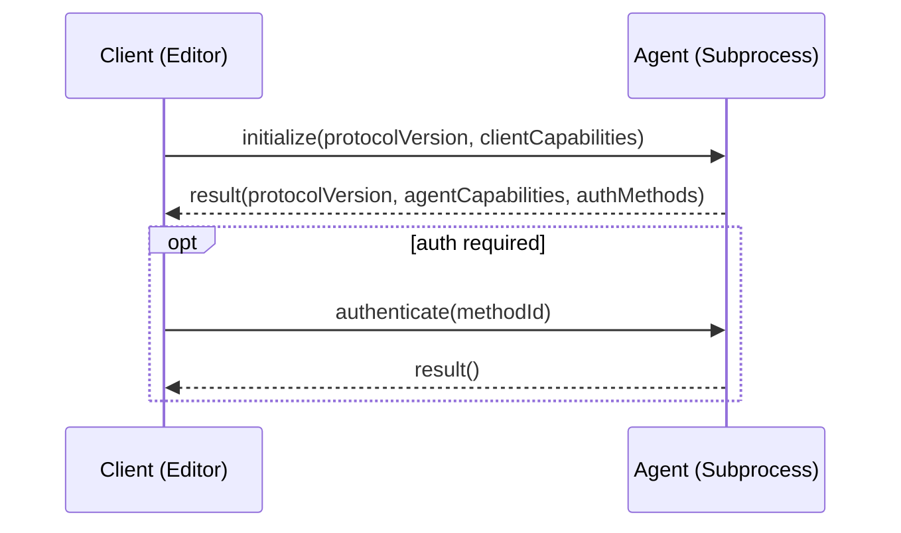
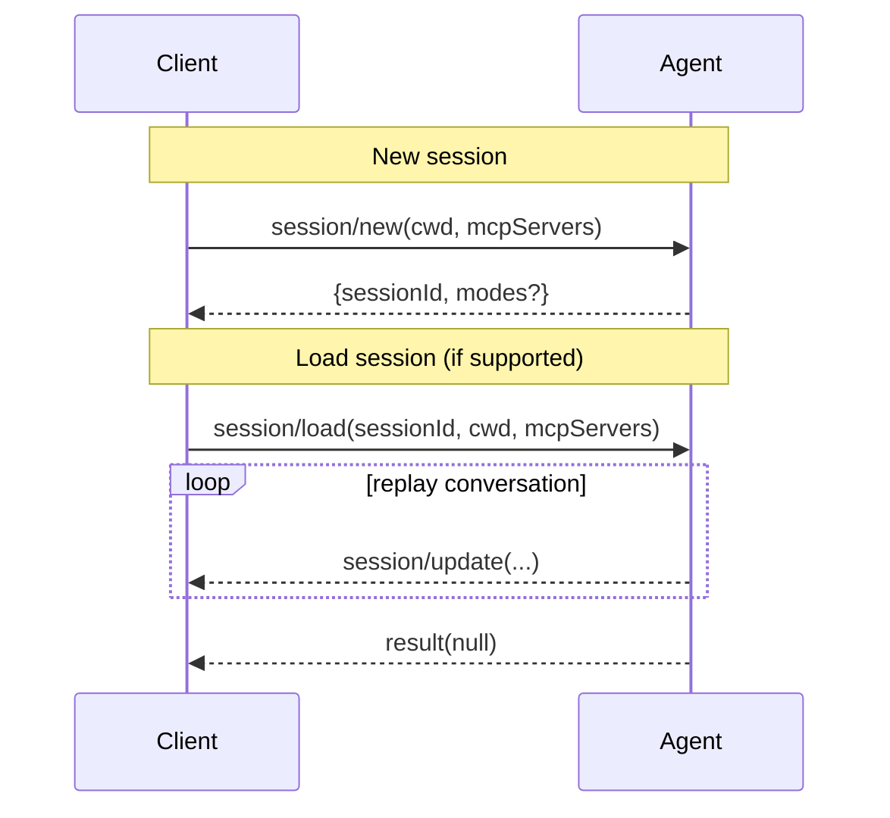
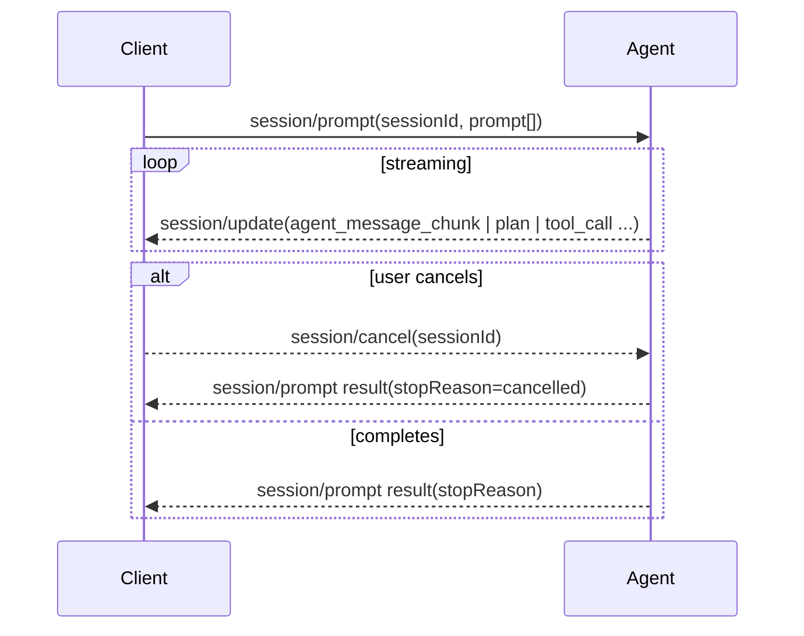
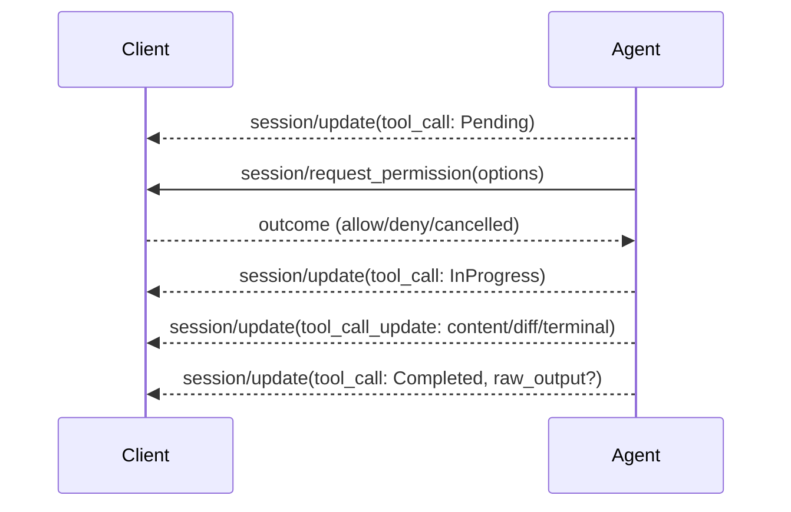
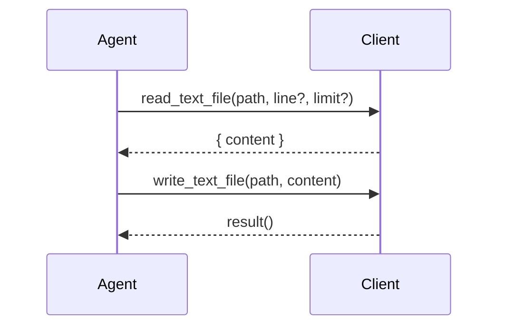
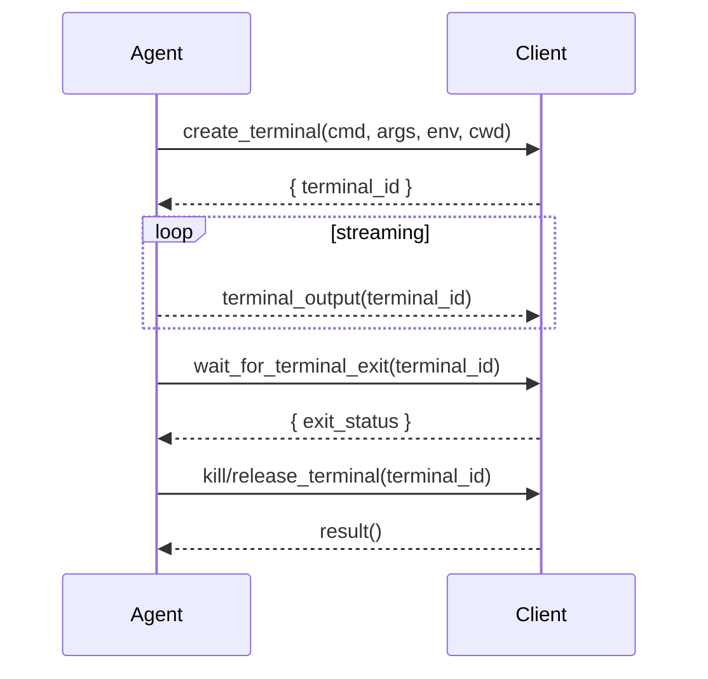
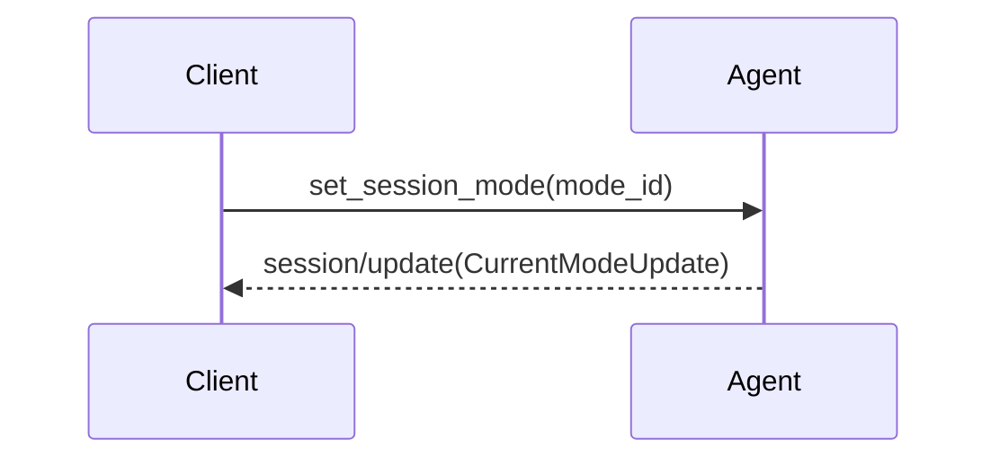

# ACP Client Best Practices

- Status: Draft
- Scope: ACP client implementers and integrators (editors/hosts)
- Protocol: ACP v1 (latest per
  [agentclientprotocol.com](https://agentclientprotocol.com))

This document distills practical guidance for implementing an Agent Client
Protocol (ACP) client that is robust, secure, and pleasant to use. It
synthesizes the ACP specification with working patterns from Zed’s production
ACP client and UI. Examples from Zed are included and marked as such.

Normative language uses MUST/SHOULD/MAY. Non‑normative rationale is provided
inline.

## 1. Core ACP vs Extensions

The ACP ecosystem has three categories of features:

**Core ACP (Stable)**
- Standard protocol features defined in the official specification
- Includes: initialization, sessions, prompts, file system, permissions, tool calls
- Guaranteed compatibility across all conformant implementations

**Unstable Features**
- Experimental features that may change or be removed
- Currently includes: terminal capability
- Requires opt-in (e.g., `features = ["unstable"]` in Rust crate)

**Implementation Extensions**
- Custom features added by specific implementations (e.g., Zed)
- Examples: session modes, model selection, available commands
- Not portable across different ACP clients

This document covers all three categories but clearly marks which is which.

## 2. Architecture & Transport

- Protocol: JSON‑RPC 2.0 over stdio.
- Directionality: Bidirectional request/response and notifications.
- Framing: Send and receive one JSON object per line on stdout/stdin. Do not
  emit non‑JSON to stdout; use stderr for logs and diagnostics.
- Process model: The client runs the agent as a subprocess and connects over the
  agent’s stdio.

Dart notes
- Use `utf8` + `LineSplitter` on stdin and `stdout.writeln` for outbound frames.
- Keep logging on stderr to avoid corrupting the JSON stream.

Sources
- Overview: https://agentclientprotocol.com/overview/introduction
- Architecture: https://agentclientprotocol.com/overview/architecture

Zed example (excerpt): crates/agent_servers/src/acp.rs
```rust
// Launch the agent subprocess with piped stdio
let mut child = util::command::new_smol_command(command.path);
child
    .args(command.args.iter().map(|arg| arg.as_str()))
    .envs(command.env.iter().flatten())
    .stdin(std::process::Stdio::piped())
    .stdout(std::process::Stdio::piped())
    .stderr(std::process::Stdio::piped());
if !is_remote { child.current_dir(root_dir); }
let mut child = child.spawn()?;

// Take stdio handles and log pid
let stdout = child.stdout.take().context("Failed to take stdout")?;
let stdin = child.stdin.take().context("Failed to take stdin")?;
let stderr = child.stderr.take().context("Failed to take stderr")?;
log::trace!("Spawned (pid: {})", child.id());

// Ensure the child is killed when the connection drops
impl Drop for AcpConnection {
    fn drop(&mut self) { self.child.kill().log_err(); }
}
```
Sources:
- Spawn and pipe stdio:
  https://github.com/zed-industries/zed/blob/e5c03730115e5578567d0f99edf374dc1296f3ee/crates/agent_servers/src/acp.rs#L81
- Kill on drop:
  https://github.com/zed-industries/zed/blob/e5c03730115e5578567d0f99edf374dc1296f3ee/crates/agent_servers/src/acp.rs#L193


## 3. Initialization & Capability Negotiation

Flow
1) Client → Agent: `initialize` with:
   - `protocolVersion` (client’s supported version; use latest)
   - `clientCapabilities` (e.g., filesystem, terminal)
2) Agent → Client: result includes:
   - `protocolVersion` (actual agreed version)
   - `agentCapabilities` (e.g., `promptCapabilities`)
   - `authMethods` (if any)

Requirements
- Protocol version is an integer (uint16, range 0-65535) identifying MAJOR protocol
  version. Only incremented for breaking changes.
- Clients MUST verify the returned `protocolVersion` and fail early if lower
  than a supported minimum.
- Clients SHOULD declare only capabilities they actually implement; agents may
  call them.
- If `authMethods` are present, clients MUST be prepared to call `authenticate`
  before creating sessions.

Zed example (client spawns agent, negotiates capabilities) Zed example
(excerpt): crates/agent_servers/src/acp.rs
```rust
let (connection, io_task) = acp::ClientSideConnection::new(client, stdin, stdout, {
    let foreground_executor = cx.foreground_executor().clone();
    move |fut| {
        foreground_executor.spawn(fut).detach();
    }
});

let io_task = cx.background_spawn(io_task);
// ...
let response = connection
    .initialize(acp::InitializeRequest {
        protocol_version: acp::VERSION,
        client_capabilities: acp::ClientCapabilities {
            fs: acp::FileSystemCapability { read_text_file: true, write_text_file: true },
            terminal: true,
        },
    })
    .await?;

if response.protocol_version < MINIMUM_SUPPORTED_VERSION { return Err(UnsupportedVersion.into()); }
```

Sources:
- Protocol Overview: https://agentclientprotocol.com/protocol/overview
- Initialization: https://agentclientprotocol.com/protocol/initialization
- Zed
  [acp.rs](https://github.com/zed-industries/zed/blob/e5c03730115e5578567d0f99edf374dc1296f3ee/crates/agent_servers/src/acp.rs#L153)

Diagram


On the wire
- Client → Agent (request)
```json
{"jsonrpc":"2.0","id":1,"method":"initialize","params":{"protocolVersion":1,"clientCapabilities":{"fs":{"readTextFile":true,"writeTextFile":true},"terminal":true}}}
```
- Agent → Client (result, success)
```json
{"jsonrpc":"2.0","id":1,"result":{"protocolVersion":1,"agentCapabilities":{"promptCapabilities":{"embeddedContext":true,"image":true}},"authMethods":[{"id":"oauth","name":"Log in with Provider"},{"id":"api_key","name":"API Key"}]}}
```
- Agent → Client (error, version unsupported)
```json
{"jsonrpc":"2.0","id":1,"error":{"code":-32603,"message":"Unsupported protocol version","data":{"minVersion":1}}}
```

Client should
- Verify `result.protocolVersion >= minimum`; otherwise show a clear, actionable error.
- Cache/remember `agentCapabilities` and `authMethods` for later flows.
- If the agent later enforces auth, present auth choices and call `authenticate` before creating sessions.


## 4. Sessions

Create
- `session/new` with:
  - `cwd`: absolute path; treats as boundary for file operations
  - `mcpServers`: optional list of MCP servers to connect
- Agent returns `sessionId` (string).
- May return `auth_required` error if authentication is needed (see Authentication section).

Load (optional)
- If `loadSession` capability is true, client MAY resume a prior session with
  `session/load`.
- Agent MUST replay the full conversation via `session/update`, then return
  `null` to the `session/load` request when the replay completes.

Requirements
- Clients MUST provide absolute `cwd` and enforce it as a security boundary for
  file operations.
- Clients MUST NOT call `session/load` if `loadSession` is not advertised.

Zed example (per‑project sessions with optional modes). Zed example (excerpt):
crates/agent_servers/src/acp.rs

```rust
let mcp_servers = if project.read(cx).is_local() {
    context_server_store.configured_server_ids().iter().filter_map(|id| {
        let configuration = context_server_store.configuration_for_server(id)?;
        let command = configuration.command();
        Some(acp::McpServer::Stdio {
            name: id.0.to_string(),
            command: command.path.clone(),
            args: command.args.clone(),
            env: command.env.as_ref().map_or(vec![], |env| env.iter()
                .map(|(name, value)| acp::EnvVariable { name: name.clone(), value: value.clone() })
                .collect()),
        })
    }).collect()
} else { Vec::new() };

let response = conn
    .new_session(acp::NewSessionRequest { mcp_servers, cwd })
    .await?;

let thread = cx.new(|cx| AcpThread::new(
    self.server_name.clone(), self.clone(), project, action_log,
    response.session_id.clone(),
    watch::Receiver::constant(self.agent_capabilities.prompt_capabilities),
    cx,
))?;
```
Sources:
- MCP servers:
  https://github.com/zed-industries/zed/blob/e5c03730115e5578567d0f99edf374dc1296f3ee/crates/agent_servers/src/acp.rs#L220
- New session:
  https://github.com/zed-industries/zed/blob/e5c03730115e5578567d0f99edf374dc1296f3ee/crates/agent_servers/src/acp.rs#L246
- Thread binding:
  https://github.com/zed-industries/zed/blob/e5c03730115e5578567d0f99edf374dc1296f3ee/crates/agent_servers/src/acp.rs#L312
- Session Setup: https://agentclientprotocol.com/protocol/session-setup

Diagram (new vs. load)


On the wire (new)
- Client → Agent
```json
{"jsonrpc":"2.0","id":2,"method":"session/new","params":{"cwd":"/abs/path/project","mcpServers":[{"name":"filesystem","command":"/usr/local/bin/mcp-fs","args":["--stdio"],"env":[{"name":"FOO","value":"bar"}]}]}}
```
- Agent → Client
```json
{"jsonrpc":"2.0","id":2,"result":{"sessionId":"sess_abc123","modes":{"currentModeId":"code","availableModes":[{"id":"code","name":"Coding"},{"id":"edit","name":"Editing"}]}}}
```

On the wire (load)
- Client → Agent
```json
{"jsonrpc":"2.0","id":3,"method":"session/load","params":{"sessionId":"sess_abc123","cwd":"/abs/path/project","mcpServers":[{"name":"filesystem","command":"/usr/local/bin/mcp-fs","args":["--stdio"],"env":[]}]}}
```
- Agent → Client (replay via notifications)
```json
{"jsonrpc":"2.0","method":"session/update","params":{"sessionId":"sess_abc123","update":{"sessionUpdate":"user_message_chunk","content":{"type":"text","text":"Hi!"}}}}
```
```json
{"jsonrpc":"2.0","method":"session/update","params":{"sessionId":"sess_abc123","update":{"sessionUpdate":"agent_message_chunk","content":{"type":"text","text":"Hello!"}}}}
```
- Agent → Client (completion of load)
```json
{"jsonrpc":"2.0","id":3,"result":null}
```

Client should
- Use absolute `cwd` and treat it as a security boundary for any FS operations routed to the client.
- Do not call `session/load` unless advertised in `initialize`.


## 5. Prompt Turn & Streaming

High‑level lifecycle
- Client → Agent: `session/prompt` with user prompt (text, resources, etc.).
- Agent → Client: streams `session/update` notifications with various types:
  - `user_message_chunk`: Echoing user's message being processed
  - `agent_message_chunk`: Agent's response text
  - `agent_thought_chunk`: Agent's internal reasoning (shown differently in UI)
  - `plan`: Execution plan with task entries
  - `tool_call`: New tool invocation
  - `tool_call_update`: Progress on existing tool call
  - `available_commands_update`: Dynamic command palette (core ACP)
  - `current_mode_update`: Mode changes (Zed extension)
- Agent → Client: final `session/prompt` response containing `stopReason`.

Stop reasons
- `end_turn`, `max_tokens`, `max_turn_requests`, `refusal`, `cancelled`.

Streaming requirements
- Agents MUST stream via `session/update` and only send the `session/prompt`
  response when the turn is complete.
- Clients MUST render streamed updates incrementally and be resilient to partial
  content.
- Clients SHOULD treat the default text format as Markdown.

Cancellation
- Client MAY send `session/cancel` anytime.
- Clients SHOULD optimistically mark pending tool calls as `cancelled` and
  resolve any pending permission prompts with a `cancelled` outcome.
- Agents MUST return `stopReason: cancelled` instead of an error when a
  cancellation occurs.

Zed examples (update handling, cancellation semantics). Zed example (excerpt):
crates/acp_thread/src/acp_thread.rs

```rust
pub fn handle_session_update(&mut self, update: acp::SessionUpdate, cx: &mut Context<Self>)
    -> Result<(), acp::Error> {
    match update {
        acp::SessionUpdate::UserMessageChunk { content } => self.push_user_content_block(None, content, cx),
        acp::SessionUpdate::AgentMessageChunk { content } => self.push_assistant_content_block(content, false, cx),
        acp::SessionUpdate::AgentThoughtChunk { content } => self.push_assistant_content_block(content, true, cx),
        acp::SessionUpdate::ToolCall(tool_call) => self.upsert_tool_call(tool_call, cx)?,
        acp::SessionUpdate::ToolCallUpdate(tool_call_update) => self.update_tool_call(tool_call_update, cx)?,
        acp::SessionUpdate::Plan(plan) => self.update_plan(plan, cx),
        acp::SessionUpdate::AvailableCommandsUpdate { available_commands } =>
            cx.emit(AcpThreadEvent::AvailableCommandsUpdated(available_commands)),
        acp::SessionUpdate::CurrentModeUpdate { current_mode_id } =>
            cx.emit(AcpThreadEvent::ModeUpdated(current_mode_id)),
    }
    Ok(())
}
```
Sources:
- https://github.com/zed-industries/zed/blob/e5c03730115e5578567d0f99edf374dc1296f3ee/crates/acp_thread/src/acp_thread.rs#L984

Zed example (excerpt): crates/agent_servers/src/acp.rs
```rust
match result {
    Ok(response) => Ok(response),
    Err(err) => {
        if err.code != ErrorCode::INTERNAL_ERROR.code { anyhow::bail!(err) }
        let Some(data) = &err.data else { anyhow::bail!(err) };
        #[derive(Deserialize)]
        struct ErrorDetails { details: Box<str> }
        match serde_json::from_value(data.clone()) {
            Ok(ErrorDetails { details }) => {
                if suppress_abort_err && (details.contains("This operation was aborted")
                    || details.contains("The user aborted a request")) {
                    Ok(acp::PromptResponse { stop_reason: acp::StopReason::Cancelled })
                } else { Err(anyhow!(details)) }
            }
            Err(_) => Err(anyhow!(err)),
        }
    }
}
```

Sources:
- https://github.com/zed-industries/zed/blob/e5c03730115e5578567d0f99edf374dc1296f3ee/crates/agent_servers/src/acp.rs#L398
- Prompt Turn: https://agentclientprotocol.com/protocol/prompt-turn
- Cancellation:
  https://agentclientprotocol.com/protocol/prompt-turn#cancellation

Diagram (prompt + streaming + cancellation)



## 6. Content & Resources

Content blocks
- `text`: primary message content (Markdown suggested)
- `resource` / `resource_link`: files or URIs
- `image`/`audio`: multimodal content

Client rendering
- Clients SHOULD render Markdown and handle large, incremental updates
  gracefully.
- Clients SHOULD convert resource URIs to clickable links with context preview
  when possible.

Zed example (excerpt): crates/acp_thread/src/acp_thread.rs
```rust
impl ContentBlock {
    pub fn append(&mut self, block: acp::ContentBlock, language_registry: &Arc<LanguageRegistry>, cx: &mut App) {
        if matches!(self, ContentBlock::Empty) && let acp::ContentBlock::ResourceLink(resource_link) = block {
            *self = ContentBlock::ResourceLink { resource_link };
            return;
        }
        let new_content = self.block_string_contents(block);
        match self {
            ContentBlock::Empty => {
                *self = Self::create_markdown_block(new_content, language_registry, cx);
            }
            ContentBlock::Markdown { markdown } => {
                markdown.update(cx, |markdown, cx| markdown.append(&new_content, cx));
            }
            ContentBlock::ResourceLink { resource_link } => {
                let existing_content = Self::resource_link_md(&resource_link.uri);
                let combined = format!("{}\n{}", existing_content, new_content);
                *self = Self::create_markdown_block(combined, language_registry, cx);
            }
        }
    }

    fn block_string_contents(&self, block: acp::ContentBlock) -> String {
        match block {
            acp::ContentBlock::Text(text_content) => text_content.text,
            acp::ContentBlock::ResourceLink(resource_link) => Self::resource_link_md(&resource_link.uri),
            acp::ContentBlock::Resource(acp::EmbeddedResource { resource: acp::EmbeddedResourceResource::TextResourceContents(acp::TextResourceContents { uri, .. }), .. }) => Self::resource_link_md(&uri),
            acp::ContentBlock::Image(image) => Self::image_md(&image),
            acp::ContentBlock::Audio(_) | acp::ContentBlock::Resource(_) => String::new(),
        }
    }
}
```

Diagram (prompt + streaming + cancellation)


On the wire (happy path)
- Client → Agent (prompt)
```json
{"jsonrpc":"2.0","id":4,"method":"session/prompt","params":{"sessionId":"sess_abc123","prompt":[{"type":"text","text":"Summarize this file."},{"type":"resource","resource":{"uri":"file:///abs/path/README.md","mimeType":"text/markdown","text":"# Title\n..."}}]}}
```
- Agent → Client (plan)
```json
{"jsonrpc":"2.0","method":"session/update","params":{"sessionId":"sess_abc123","update":{"sessionUpdate":"plan","title":"Summarize file","steps":[{"id":"s1","text":"Read file"},{"id":"s2","text":"Draft summary"}],"status":"in_progress"}}}
```
- Agent → Client (assistant text chunk)
```json
{"jsonrpc":"2.0","method":"session/update","params":{"sessionId":"sess_abc123","update":{"sessionUpdate":"agent_message_chunk","content":{"type":"text","text":"Let me read the file and summarize it..."}}}}
```
- Agent → Client (stop)
```json
{"jsonrpc":"2.0","id":4,"result":{"stopReason":"end_turn"}}
```

On the wire (cancellation)
- Client → Agent (cancel notification)
```json
{"jsonrpc":"2.0","method":"session/cancel","params":{"sessionId":"sess_abc123"}}
```
- Agent → Client (prompt completed as cancelled)
```json
{"jsonrpc":"2.0","id":4,"result":{"stopReason":"cancelled"}}
```

Client should
- Append streamed `session/update` content incrementally.
- Treat `stopReason` as the authoritative end of the turn.
- After sending `session/cancel`, optimistically mark pending tool calls as cancelled and resolve any outstanding permission prompts with `cancelled`.
Sources:
- append():
  https://github.com/zed-industries/zed/blob/e5c03730115e5578567d0f99edf374dc1296f3ee/crates/acp_thread/src/acp_thread.rs#L457
- block_string_contents():
  https://github.com/zed-industries/zed/blob/e5c03730115e5578567d0f99edf374dc1296f3ee/crates/acp_thread/src/acp_thread.rs#L499

Sources
- Content: https://agentclientprotocol.com/protocol/content
- Zed repo paths above

On the wire
- Agent → Client (replayed or live)
```json
{"jsonrpc":"2.0","method":"session/update","params":{"sessionId":"sess_abc123","update":{"sessionUpdate":"agent_message_chunk","content":{"type":"text","text":"Here is an update with a resource link: file:///abs/path/src/main.rs"}}}}
```

Client should
- Render Markdown; coalesce successive text chunks for smooth UX.
- Convert `resource_link` and `resource` to clickable anchors with previews where possible.


## 7. Tool Calls & Permissioning

Lifecycle
1) Agent emits `SessionUpdate::ToolCall` with initial metadata (`id`, `title`,
   `kind`, `locations`, optional `raw_input`).
   
   Tool kinds (ToolKind enum):
   - `read`: Reading files or data
   - `edit`: Modifying files or content  
   - `delete`: Removing files or data
   - `move`: Moving or renaming files
   - `search`: Searching for information
   - `execute`: Running commands or code
   - `think`: Internal reasoning or planning
   - `fetch`: Retrieving external data
   - `other`: Other tool types (default)
2) Client MAY respond to `session/request_permission` to authorize execution;
   show arguments; support “always allow” if appropriate.
3) Agent streams `ToolCallUpdate` with `status` transitions and `content` (e.g.,
   diffs, terminal output, rich content).
4) Agent sets `status: completed` and MAY include `raw_output` for debugging or
   auditing.

Requirements
- Agents MUST use `Pending` → `InProgress` → `Completed`/`Failed`; clients
  SHOULD reflect progress immediately.
- Clients MUST surface permission prompts clearly, including parameters
  (`raw_input`) and locations.
- Clients SHOULD show diffs as first‑class UI, with accept/reject affordances.
- Clients SHOULD show terminal output incrementally where provided.

Zed example (excerpt): crates/acp_thread/src/acp_thread.rs

```rust
fn update_fields(&mut self, fields: acp::ToolCallUpdateFields, language_registry: Arc<LanguageRegistry>,
    terminals: &HashMap<acp::TerminalId, Entity<Terminal>>, cx: &mut App) -> Result<()> {
    let acp::ToolCallUpdateFields { kind, status, title, content, locations, raw_input, raw_output } = fields;
    if let Some(kind) = kind { self.kind = kind; }
    if let Some(status) = status { self.status = status.into(); }
    if let Some(title) = title {
        self.label.update(cx, |label, cx| {
            if let Some((first_line, _)) = title.split_once("\n") {
                label.replace(first_line.to_owned() + "…", cx)
            } else { label.replace(title, cx); }
        });
    }
    if let Some(content) = content {
        let new_content_len = content.len();
        let mut content = content.into_iter();
        for (old, new) in self.content.iter_mut().zip(content.by_ref()) {
            old.update_from_acp(new, language_registry.clone(), terminals, cx)?;
        }
        for new in content {
            self.content.push(ToolCallContent::from_acp(new, language_registry.clone(), terminals, cx)?)
        }
        self.content.truncate(new_content_len);
    }
    if let Some(locations) = locations { self.locations = locations; }
    if let Some(raw_input) = raw_input { self.raw_input = Some(raw_input); }
    if let Some(raw_output) = raw_output { /* add markdown fallback, then set */ }
    Ok(())
}
```

Sources:
- https://github.com/zed-industries/zed/blob/e5c03730115e5578567d0f99edf374dc1296f3ee/crates/acp_thread/src/acp_thread.rs#L221

Zed example (excerpt): crates/agent_servers/src/acp.rs
```rust
async fn request_permission(&self, arguments: acp::RequestPermissionRequest)
    -> Result<acp::RequestPermissionResponse, acp::Error> {
    let respect_always_allow_setting = session.session_modes.is_none();
    let task = thread.update(cx, |thread, cx| {
        thread.request_tool_call_authorization(arguments.tool_call, arguments.options,
            respect_always_allow_setting, cx)
    })??;
    let outcome = task.await;
    Ok(acp::RequestPermissionResponse { outcome })
}
```

Source:
- https://github.com/zed-industries/zed/blob/e5c03730115e5578567d0f99edf374dc1296f3ee/crates/agent_servers/src/acp.rs#L501
- Tool Calls: https://agentclientprotocol.com/protocol/tool-calls
- Requesting Permission:
  https://agentclientprotocol.com/protocol/tool-calls#requesting-permission
- Status: https://agentclientprotocol.com/protocol/tool-calls#status

Diagram (tool call + permission)



## 8. Filesystem Access (Client Capabilities)

- Methods: `read_text_file`, `write_text_file`.
- Security: Clients MUST scope operations to the session `cwd` (or configured
  sandbox) and block traversal outside it.
- UX: Show file previews and diffs; allow targeted reads (line/limit) for large
  files.

Zed examples (client capabilities implemented in the host). Zed example
(excerpt): crates/agent_servers/src/acp.rs

```rust
async fn write_text_file(&self, arguments: acp::WriteTextFileRequest) -> Result<(), acp::Error> {
    let task = self.session_thread(&arguments.session_id)?.update(cx, |thread, cx| {
        thread.write_text_file(arguments.path, arguments.content, cx)
    })?;
    task.await?;
    Ok(())
}

async fn read_text_file(&self, arguments: acp::ReadTextFileRequest)
  -> Result<acp::ReadTextFileResponse, acp::Error> {
    let task = self.session_thread(&arguments.session_id)?.update(&mut self.cx.clone(), |thread, cx| {
        thread.read_text_file(arguments.path, arguments.line, arguments.limit, false, cx)
    })?;
    let content = task.await?;
    Ok(acp::ReadTextFileResponse { content })
}
```

Sources:
- write_text_file:
  https://github.com/zed-industries/zed/blob/e5c03730115e5578567d0f99edf374dc1296f3ee/crates/agent_servers/src/acp.rs#L532
- read_text_file:
  https://github.com/zed-industries/zed/blob/e5c03730115e5578567d0f99edf374dc1296f3ee/crates/agent_servers/src/acp.rs#L548
- File System: https://agentclientprotocol.com/protocol/file-system
- Reading Files:
  https://agentclientprotocol.com/protocol/file-system#reading-files
- Writing Files:
  https://agentclientprotocol.com/protocol/file-system#writing-files

On the wire (agent calls client FS)
- Agent → Client (read)
```json
{"jsonrpc":"2.0","id":31,"method":"read_text_file","params":{"sessionId":"sess_abc123","path":"/abs/path/README.md","line":1,"limit":2000}}
```
- Client → Agent (read result)
```json
{"jsonrpc":"2.0","id":31,"result":{"content":"# README\n..."}}
```
- Agent → Client (write)
```json
{"jsonrpc":"2.0","id":32,"method":"write_text_file","params":{"sessionId":"sess_abc123","path":"/abs/path/CHANGELOG.md","content":"- Add feature X\n"}}
```
- Client → Agent (write result)
```json
{"jsonrpc":"2.0","id":32,"result":null}
```

Client should
- Enforce `cwd` boundary; reject requests escaping the project root with a clear error.
- For large files, respect `line`/`limit` and stream content via multiple reads if needed.

Diagram (FS callbacks)



## 9. Terminal Capability (UNSTABLE - Optional but Recommended)

**Status**: UNSTABLE feature - not part of stable ACP spec. May change or be removed.

- Enabling: Requires opt-in via library features (e.g., `features = ["unstable"]` in Rust)
- Methods: `create_terminal`, `terminal_output`, `wait_for_terminal_exit`,
  `kill_terminal`, `release_terminal`.
- Usage: Provide streaming terminal output as `ToolCallContent::Terminal` within
  tool updates.
- UX: Offer a dedicated terminal view per tool call; make output scannable and
  copyable.
- ClientCapabilities: Declared via `terminal: true` (boolean field)

Zed example (excerpt): crates/agent_servers/src/acp.rs

```rust
async fn create_terminal(&self, args: acp::CreateTerminalRequest)
  -> Result<acp::CreateTerminalResponse, acp::Error> {
    let terminal = self.session_thread(&args.session_id)?.update(&mut self.cx.clone(), |thread, cx| {
        thread.create_terminal(args.command, args.args, args.env, args.cwd, args.output_byte_limit, cx)
    })?.await?;
    Ok(terminal.read_with(&self.cx, |terminal, _| acp::CreateTerminalResponse {
        terminal_id: terminal.id().clone(),
    })?)
}

async fn terminal_output(&self, args: acp::TerminalOutputRequest)
  -> Result<acp::TerminalOutputResponse, acp::Error> {
    self.session_thread(&args.session_id)?.read_with(&mut self.cx.clone(), |thread, cx| {
        let out = thread.terminal(args.terminal_id)?.read(cx).current_output(cx);
        Ok(out)
    })?
}
```
Sources:
- create_terminal:
  https://github.com/zed-industries/zed/blob/e5c03730115e5578567d0f99edf374dc1296f3ee/crates/agent_servers/src/acp.rs#L590
- terminal_output:
  https://github.com/zed-industries/zed/blob/e5c03730115e5578567d0f99edf374dc1296f3ee/crates/agent_servers/src/acp.rs#L632
- Terminal: https://agentclientprotocol.com/protocol/terminal

On the wire (agent uses client terminal)
- Agent → Client (create)
```json
{"jsonrpc":"2.0","id":41,"method":"create_terminal","params":{"sessionId":"sess_abc123","command":"bash","args":["-lc","pytest"],"env":[],"cwd":"/abs/path/project","outputByteLimit":8192}}
```
- Client → Agent (created)
```json
{"jsonrpc":"2.0","id":41,"result":{"terminalId":"term_001"}}
```
- Agent → Client (get output)
```json
{"jsonrpc":"2.0","id":42,"method":"terminal_output","params":{"sessionId":"sess_abc123","terminalId":"term_001"}}
```
- Client → Agent (output)
```json
{"jsonrpc":"2.0","id":42,"result":{"stdout":"....","stderr":"","exitStatus":null}}
```
- Agent → Client (wait for exit)
```json
{"jsonrpc":"2.0","id":43,"method":"wait_for_terminal_exit","params":{"sessionId":"sess_abc123","terminalId":"term_001"}}
```
- Client → Agent (exited)
```json
{"jsonrpc":"2.0","id":43,"result":{"exitStatus":0}}
```

Client should
- Expose terminal output to the UI incrementally; keep the buffer until released.
- Honor `kill_terminal` and `release_terminal` and free resources.

Diagram (terminal lifecycle)



## 10. Modes and Model Selection (Zed Extension)

**Status**: Zed-specific extension - not part of standard ACP.

- Session modes: Custom feature allowing agents to expose modes (e.g., "code", "edit", "plan")
  via `modes` in session setup and `set_session_mode` method.
- Available commands: The `available_commands_update` in SessionUpdate IS part of core ACP,
  allowing agents to advertise available commands dynamically.
- Model selection: Implementation-specific feature for choosing different AI models.
- Clients SHOULD surface mode selectors and command palettes when these extensions
  are provided by the agent.

Zed example (excerpt): crates/agent_servers/src/acp.rs
```rust
// If a default mode is configured and available, set it and optimistically
// update local state, reverting if the RPC fails.
if let Some(default_mode) = default_mode {
    if let Some(modes) = modes.as_ref() {
        let mut modes_ref = modes.borrow_mut();
        let has_mode = modes_ref.available_modes.iter().any(|mode| mode.id == default_mode);
        if has_mode {
            let initial_mode_id = modes_ref.current_mode_id.clone();
            cx.spawn({
                let default_mode = default_mode.clone();
                let session_id = response.session_id.clone();
                let modes = modes.clone();
                async move |_| {
                    let result = conn.set_session_mode(acp::SetSessionModeRequest { session_id, mode_id: default_mode }).await.log_err();
                    if result.is_none() { modes.borrow_mut().current_mode_id = initial_mode_id; }
                }
            }).detach();
            modes_ref.current_mode_id = default_mode;
        }
    }
}
```
Sources:
- set_session_mode (fallback):
  https://github.com/zed-industries/zed/blob/e5c03730115e5578567d0f99edf374dc1296f3ee/crates/agent_servers/src/acp.rs#L277
- model selector UI:
  https://github.com/zed-industries/zed/blob/e5c03730115e5578567d0f99edf374dc1296f3ee/crates/agent_ui/src/acp/model_selector.rs#L20
- Protocol Overview: https://agentclientprotocol.com/protocol/overview
- Schema: https://agentclientprotocol.com/protocol/schema

Diagram (mode updates)


On the wire
- Client → Agent (set)
```json
{"jsonrpc":"2.0","id":51,"method":"session/set_mode","params":{"sessionId":"sess_abc123","modeId":"edit"}}
```
- Agent → Client (notify current mode)
```json
{"jsonrpc":"2.0","method":"session/update","params":{"sessionId":"sess_abc123","update":{"sessionUpdate":"current_mode_update","currentModeId":"edit"}}}
```


## 11. Authentication

- Agents advertise `authMethods` during `initialize`.
- When `session/new` returns an `auth_required` error:
  - Client MUST present available auth methods to user
  - Call `authenticate` with selected `methodId`
  - Retry `session/new` after successful authentication
- Error handling: The `auth_required` error includes details about why auth is needed
- Clients call `authenticate` flow of choice and retry session creation.
- UX: Prefer browser‑based auth where available; store API keys securely; keep
  credentials out of JSON‑RPC logs.

Zed examples (excerpts):
```rust
// Send authenticate request
fn authenticate(&self, method_id: acp::AuthMethodId, cx: &mut App) -> Task<Result<()>> {
    let conn = self.connection.clone();
    cx.foreground_executor().spawn(async move {
        let result = conn.authenticate(acp::AuthenticateRequest { method_id: method_id.clone() }).await?;
        Ok(result)
    })
}

// Error used to drive UX when auth is required
#[derive(Debug)]
pub struct AuthRequired {
    pub description: Option<String>,
    pub provider_id: Option<LanguageModelProviderId>,
}
```
Sources:
- authenticate wiring:
  https://github.com/zed-industries/zed/blob/e5c03730115e5578567d0f99edf374dc1296f3ee/crates/agent_servers/src/acp.rs#L343
- AuthRequired error:
  https://github.com/zed-industries/zed/blob/e5c03730115e5578567d0f99edf374dc1296f3ee/crates/acp_thread/src/connection.rs#L130
- Initialization: https://agentclientprotocol.com/protocol/initialization
- Schema (authenticate):
  https://agentclientprotocol.com/protocol/schema#authenticate

On the wire
- Client → Agent (authenticate)
```json
{"jsonrpc":"2.0","id":61,"method":"authenticate","params":{"methodId":"oauth"}}
```
- Agent → Client (success)
```json
{"jsonrpc":"2.0","id":61,"result":null}
```
- Agent → Client (error)
```json
{"jsonrpc":"2.0","id":61,"error":{"code":-32603,"message":"Auth failed","data":{"details":"Token expired"}}}
```

Client should
- Retry `session/new` after successful auth.
- Surface failures with actionable next steps (re-login, set API key, etc.).


## 12. Error Handling & Cancellations

- Use structured JSON‑RPC errors with standard ACP error codes where applicable.
- Treat cancellations as a first‑class stop reason, not as an error.
- Map provider/SDK abort exceptions into `StopReason::Cancelled` on the
  `session/prompt` result.

Sources:
- https://github.com/zed-industries/zed/blob/e5c03730115e5578567d0f99edf374dc1296f3ee/crates/agent_servers/src/acp.rs#L398
- Cancellation:
  https://agentclientprotocol.com/protocol/prompt-turn#cancellation

Zed example (excerpt): crates/agent_servers/src/acp.rs
```rust
fn cancel(&self, session_id: &acp::SessionId, cx: &mut App) {
    if let Some(session) = self.sessions.borrow_mut().get_mut(session_id) {
        session.suppress_abort_err = true;
    }
    let conn = self.connection.clone();
    let params = acp::CancelNotification { session_id: session_id.clone() };
    cx.foreground_executor().spawn(async move { conn.cancel(params).await }).detach();
}
```
Source:
- https://github.com/zed-industries/zed/blob/e5c03730115e5578567d0f99edf374dc1296f3ee/crates/agent_servers/src/acp.rs#L411

Common error codes (examples)
- `AUTH_REQUIRED` (agent-specific mapping): show auth UI; reattempt after `authenticate`.
- `INVALID_PARAMS` (JSON-RPC -32602): log + correct client bug; show actionable error.
- `INTERNAL_ERROR` (JSON-RPC -32603): show agent-side failure; do not retry blindly.

Client should
- Return `stopReason: cancelled` for cancels rather than surfacing provider abort exceptions as errors.


## 13. Streaming, Concurrency, and Backpressure

- Stream small, frequent `session/update` notifications; flush promptly.
- Clients SHOULD process updates on a foreground/UI executor and offload heavy
  work to background executors.
- Backpressure: If the transport applies backpressure, agents SHOULD coalesce
  updates or yield between batches.

Dart notes
- Use `StreamController.broadcast()` for inbound/outbound channels; consider
  `pause`/`resume` semantics if the consumer falls behind.
- Avoid blocking the event loop; offload CPU‑heavy work to isolates or
  background services.

Sources:
- ACP logs viewer:
  https://github.com/zed-industries/zed/blob/e5c03730115e5578567d0f99edf374dc1296f3ee/crates/acp_tools/src/acp_tools.rs#L164
- Stderr reader task:
  https://github.com/zed-industries/zed/blob/e5c03730115e5578567d0f99edf374dc1296f3ee/crates/agent_servers/src/acp.rs#L119


## 14. Security & Trust

- ACP assumes a trusted agent; still gate privileged actions via
  `session/request_permission`.
- Enforce `cwd` boundaries for all file operations.
- Use least privilege for launched MCP servers and environment.
- Never write secrets to stdout; emit logs to stderr.

Sources:
- Architecture (Trusted):
  https://agentclientprotocol.com/overview/architecture#design-philosophy
- Working Directory:
  https://agentclientprotocol.com/protocol/session-setup#working-directory
- MCP: https://agentclientprotocol.com/overview/architecture#mcp


## 15. Versioning & Compatibility

- Negotiate `protocolVersion` in `initialize`; clients SHOULD enforce a minimum
  supported version and fail fast with a user‑facing error.
- Prefer forward‑compatible handling of unknown fields in streamed updates.

Sources:
- MINIMUM_SUPPORTED_VERSION and enforcement:
  https://github.com/zed-industries/zed/blob/e5c03730115e5578567d0f99edf374dc1296f3ee/crates/agent_servers/src/acp.rs#L165


## 16. Telemetry, Tracing, and Debugging

- Provide a log/trace view of JSON‑RPC traffic for troubleshooting.
- Correlate request/response IDs and show direction (incoming/outgoing) and
  payloads.
- Redact sensitive fields when showing in UI/logs.

Zed example (ACP logs tool) Zed example (excerpt):
crates/acp_tools/src/acp_tools.rs:160

```rust
let (request_id, method, message_type, params) = match stream_message.message {
    acp::StreamMessageContent::Request { id, method, params } => {
        // Track incoming vs outgoing request method names by id for later response correlation
        let method_map = match stream_message.direction {
            acp::StreamMessageDirection::Incoming => &mut connection.incoming_request_methods,
            acp::StreamMessageDirection::Outgoing => &mut connection.outgoing_request_methods,
        };
        method_map.insert(id, method.clone());
        (Some(id), method.into(), MessageType::Request, Ok(params))
    }
    acp::StreamMessageContent::Response { id, result } => {
        let method_map = match stream_message.direction {
            acp::StreamMessageDirection::Incoming => &mut connection.outgoing_request_methods,
            acp::StreamMessageDirection::Outgoing => &mut connection.incoming_request_methods,
        };
        if let Some(method) = method_map.remove(&id) {
            (Some(id), method.into(), MessageType::Response, result)
        } else {
            (Some(id), "[unrecognized response]".into(), MessageType::Response, result)
        }
    }
    acp::StreamMessageContent::Notification { method, params } => {
        (None, method.into(), MessageType::Notification, Ok(params))
    }
};
```

Sources:
- https://github.com/zed-industries/zed/blob/e5c03730115e5578567d0f99edf374dc1296f3ee/crates/acp_tools/src/acp_tools.rs#L164


## 17. Testing & Conformance

Minimal conformance checklist (client)
- Initialize: negotiates protocol version; declares only true capabilities
- Sessions: creates with absolute `cwd`; optional `session/load` gated by
  capability
- Prompt: streams updates; returns final stop reason; handles all
  `SessionUpdate` variants
- Permissioning: handles `session/request_permission`; returns selected outcome;
  supports cancellation
- Filesystem: enforces `cwd` boundary; read/write text files; large file
  handling (line/limit)
- Terminal: optional but complete set if declared (create, output, wait, kill,
  release)
- Cancellation: `session/cancel` honored; pending permission prompts resolved;
  maps abort exceptions to `cancelled`
- Errors: uses ACP error codes; logs structured errors; avoids leaking secrets

Trace fixture format (for tests)
- JSONL, each line a JSON object:
  - `{"direction":"outgoing","jsonrpc":"2.0","id":N,"method":"initialize",...}`
  - `{"direction":"incoming","jsonrpc":"2.0","id":N,"result":{...}}`
  - `{"direction":"incoming","jsonrpc":"2.0","method":"session/update","params":{...}}`
- Validate ordering, streaming, and final stop reason for each prompt turn.


## 18. Integration Patterns (Hosts like Zed)

- Process lifecycle: spawn agent with piped stdio; kill on drop; stream stderr
  into host logs with JSON recognition fallback.
- Session model: associate `sessionId` with a thread UI and action log; manage
  modes/model selection per session.
- UI: incremental rendering of message chunks, thoughts, plans; rich diffs;
  terminal panes; explicit permission prompts with argument previews and
  locations.

Sources:
- Stderr background task:
  https://github.com/zed-industries/zed/blob/e5c03730115e5578567d0f99edf374dc1296f3ee/crates/agent_servers/src/acp.rs#L119
- Kill on drop:
  https://github.com/zed-industries/zed/blob/e5c03730115e5578567d0f99edf374dc1296f3ee/crates/agent_servers/src/acp.rs#L196
- Thread model (updates):
  https://github.com/zed-industries/zed/blob/e5c03730115e5578567d0f99edf374dc1296f3ee/crates/acp_thread/src/acp_thread.rs#L984


## 19. Implementation Notes (non‑normative)

- Dart-specific: Stdio transport: `LineSplitter` for inbound frames;
  `stdout.writeln` for outbound; keep stderr for logs.
- Dart-specific: Streams: Use `StreamChannel<String>` and
  `StreamController.broadcast()`; consider `pause`/`resume` for backpressure;
  avoid tight loops, add small `await` yields when batching updates.
- Cancellation: Implement idempotent `cancel` that resolves any pending
  permission interaction and surfaces `StopReason::Cancelled` in the prompt
  response path.
- JSON: Keep envelope small; prefer streaming multiple small updates over giant
  payloads.


## 20. References

ACP specification
- Overview: https://agentclientprotocol.com/overview/introduction
- Architecture: https://agentclientprotocol.com/overview/architecture
- Protocol Overview: https://agentclientprotocol.com/protocol/overview
- Initialization: https://agentclientprotocol.com/protocol/initialization
- Session Setup: https://agentclientprotocol.com/protocol/session-setup
- Prompt Turn: https://agentclientprotocol.com/protocol/prompt-turn
- Content: https://agentclientprotocol.com/protocol/content
- Tool Calls: https://agentclientprotocol.com/protocol/tool-calls
- File System: https://agentclientprotocol.com/protocol/file-system
- Terminal: https://agentclientprotocol.com/protocol/terminal
- Schema: https://agentclientprotocol.com/protocol/schema
- Local snapshot: `specs/acp-llms.txt`

Zed source (client side)
- Spawn & connection:
  https://github.com/zed-industries/zed/blob/e5c03730115e5578567d0f99edf374dc1296f3ee/crates/agent_servers/src/acp.rs#L104
- Initialize capabilities:
  https://github.com/zed-industries/zed/blob/e5c03730115e5578567d0f99edf374dc1296f3ee/crates/agent_servers/src/acp.rs#L153
- MCP server list:
  https://github.com/zed-industries/zed/blob/e5c03730115e5578567d0f99edf374dc1296f3ee/crates/agent_servers/src/acp.rs#L220
- New session:
  https://github.com/zed-industries/zed/blob/e5c03730115e5578567d0f99edf374dc1296f3ee/crates/agent_servers/src/acp.rs#L246
- Thread/session binding:
  https://github.com/zed-industries/zed/blob/e5c03730115e5578567d0f99edf374dc1296f3ee/crates/agent_servers/src/acp.rs#L312
- Session modes:
  https://github.com/zed-industries/zed/blob/e5c03730115e5578567d0f99edf374dc1296f3ee/crates/agent_servers/src/acp.rs#L277
- Cancellation mapping:
  https://github.com/zed-industries/zed/blob/e5c03730115e5578567d0f99edf374dc1296f3ee/crates/agent_servers/src/acp.rs#L398
- Authenticate:
  https://github.com/zed-industries/zed/blob/e5c03730115e5578567d0f99edf374dc1296f3ee/crates/agent_servers/src/acp.rs#L343
- Permission UI flow:
  https://github.com/zed-industries/zed/blob/e5c03730115e5578567d0f99edf374dc1296f3ee/crates/agent_servers/src/acp.rs#L501
- Write file:
  https://github.com/zed-industries/zed/blob/e5c03730115e5578567d0f99edf374dc1296f3ee/crates/agent_servers/src/acp.rs#L532
- Read file:
  https://github.com/zed-industries/zed/blob/e5c03730115e5578567d0f99edf374dc1296f3ee/crates/agent_servers/src/acp.rs#L548
- Create terminal:
  https://github.com/zed-industries/zed/blob/e5c03730115e5578567d0f99edf374dc1296f3ee/crates/agent_servers/src/acp.rs#L590
- Terminal output:
  https://github.com/zed-industries/zed/blob/e5c03730115e5578567d0f99edf374dc1296f3ee/crates/agent_servers/src/acp.rs#L632

Zed source (UI & thread model)
- ToolCall::from_acp:
  https://github.com/zed-industries/zed/blob/e5c03730115e5578567d0f99edf374dc1296f3ee/crates/acp_thread/src/acp_thread.rs#L184
- ToolCallUpdateFields:
  https://github.com/zed-industries/zed/blob/e5c03730115e5578567d0f99edf374dc1296f3ee/crates/acp_thread/src/acp_thread.rs#L221
- SessionUpdate handling:
  https://github.com/zed-industries/zed/blob/e5c03730115e5578567d0f99edf374dc1296f3ee/crates/acp_thread/src/acp_thread.rs#L984
- Model selector UI:
  https://github.com/zed-industries/zed/blob/e5c03730115e5578567d0f99edf374dc1296f3ee/crates/agent_ui/src/acp/model_selector.rs#L20
- ACP logs viewer:
  https://github.com/zed-industries/zed/blob/e5c03730115e5578567d0f99edf374dc1296f3ee/crates/acp_tools/src/acp_tools.rs#L164

Zed docs
- `/docs/src/ai/external-agents.md` — external agents, debug view

## Appendix: Conformance Checklist

Use this checklist to verify an ACP client implementation. Check only items that
apply to your declared capabilities.

- Transport & Initialization
  - [ ] JSON‑RPC 2.0 over stdio; no non‑JSON on stdout; logs on stderr
  - [ ] Sends `initialize(protocolVersion, clientCapabilities)`
  - [ ] Verifies returned `protocolVersion` ≥ minimum; handles `authMethods`

- Sessions
  - [ ] Calls `session/new` with absolute `cwd`; optionally passes `mcpServers`
  - [ ] Enforces `cwd` boundary for all FS operations
  - [ ] Uses `session/load` only if `loadSession` is advertised; consumes replay
    fully

- Prompt Turn & Streaming
  - [ ] Sends `session/prompt` with structured content blocks
  - [ ] Processes all `session/update` variants (agent_message_chunk,
    agent_thought_chunk, plan, tool_call, tool_call_update,
    available_commands_update, current_mode_update)
  - [ ] Final response includes `stopReason` and supports all reasons

- Tool Calls & Permissioning
  - [ ] Renders tool call `title`, `kind`, `locations`, `raw_input`
  - [ ] Implements `session/request_permission` (allow/deny/cancelled; “always
    allow” if applicable)
  - [ ] Tracks status transitions Pending → InProgress → Completed/Failed;
    surfaces diffs/terminal/content updates
  - [ ] Displays `raw_output` when present

- File System Capability (if declared)
  - [ ] Implements `read_text_file` (line/limit) and `write_text_file`
  - [ ] Prevents traversal outside `cwd`; handles large files gracefully

- Terminal Capability (if declared)
  - [ ] Implements `create_terminal`, `terminal_output` (stream),
    `wait_for_terminal_exit`, `kill_terminal`, `release_terminal`
  - [ ] Presents live terminal output and preserves history until release

- Modes & Model Selection (if provided)
  - [ ] Displays available modes; calls `set_session_mode`; reflects
    `CurrentModeUpdate`
  - [ ] Lists/selects models per session; persists selection

- Authentication (if required)
  - [ ] Presents `authMethods`; runs chosen flow; stores secrets securely;
    retries after auth

- Cancellation
  - [ ] Supports `session/cancel`; marks in‑flight tool calls as cancelled;
    resolves pending permissions with `cancelled`
  - [ ] Maps provider aborts to `StopReason::Cancelled` on `session/prompt`

- Error Handling
  - [ ] Uses ACP error codes; structures errors; redacts secrets from logs/UI

- Backpressure & Concurrency
  - [ ] Processes updates without blocking UI; coalesces batches; yields between
    bursts
  - [ ] Offloads heavy work to background executors/isolates

- Security
  - [ ] Trust model documented; permission gates for destructive actions
  - [ ] Least‑privilege env for MCP; stdout free of secrets

- Telemetry & Debugging
  - [ ] Provides JSON‑RPC traffic logs (direction, ids, params/results/errors)
    with redaction
  - [ ] Correlates request/response ids; supports filtering

- Versioning & Compatibility
  - [ ] Enforces minimum supported protocol version
  - [ ] Ignores unknown fields gracefully in updates

- Testing & Fixtures
  - [ ] Ships JSONL traces for: init, new session, prompt with updates,
    tool‑call w/ permission, cancellation, FS op, terminal op, modes
  - [ ] Validates ordering and final `stopReason` for each prompt turn
