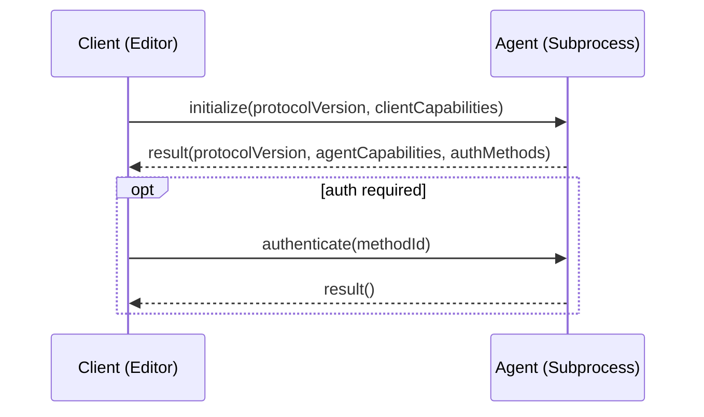
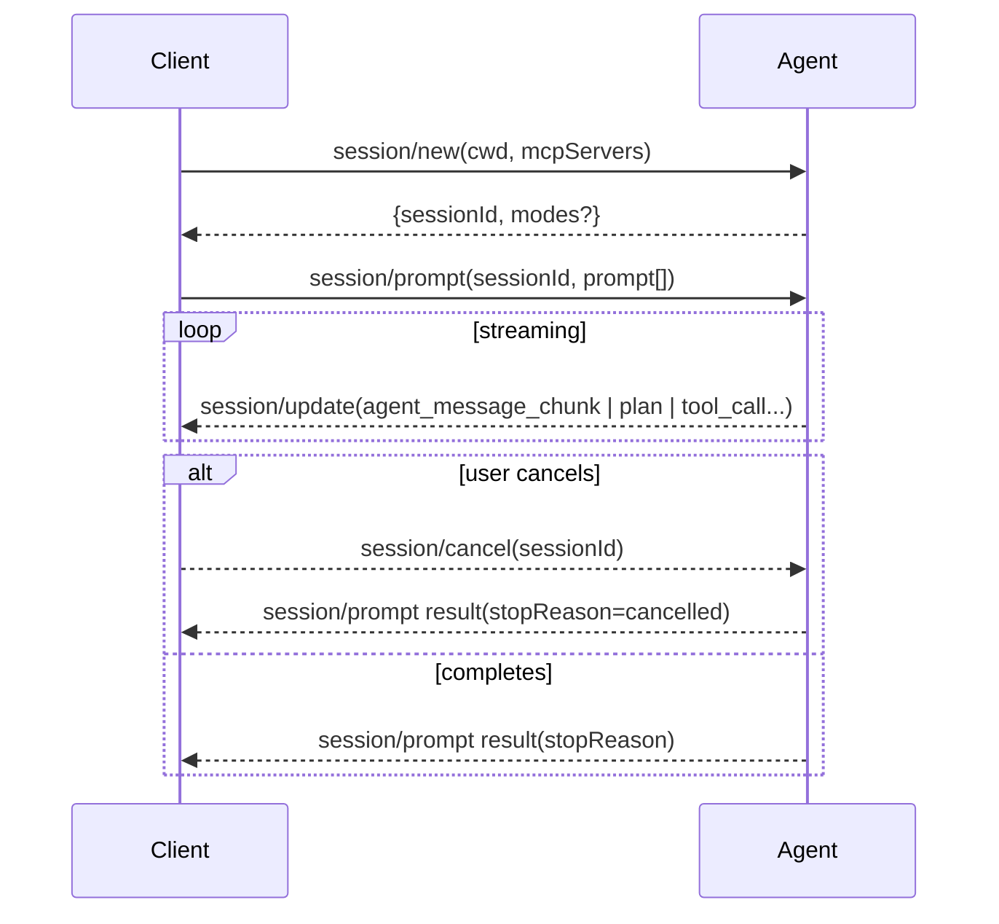
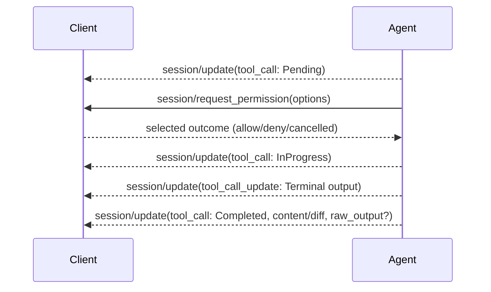

# ACP Client Best Practices (Language‑Agnostic, with Dart Notes)

Status: Draft
Scope: ACP client implementers and integrators (editors/hosts)
Protocol: ACP v1 (latest per agentclientprotocol.com)

This document distills practical guidance for implementing an ACP client that is robust, secure, and pleasant to use. It synthesizes the ACP specification with working patterns from Zed’s production ACP client and UI. Examples from Zed are included and marked as such.

Normative language uses MUST/SHOULD/MAY. Non‑normative rationale is provided inline.

—

## 1. Architecture & Transport

- Protocol: JSON‑RPC 2.0 over stdio.
- Directionality: Bidirectional request/response and notifications.
- Framing: Send and receive one JSON object per line on stdout/stdin. Do not emit non‑JSON to stdout; use stderr for logs and diagnostics.
- Process model: The client runs the agent as a subprocess and connects over the agent’s stdio.

Dart notes
- Use `utf8` + `LineSplitter` on stdin and `stdout.writeln` for outbound frames.
- Keep logging on stderr to avoid corrupting the JSON stream.

Sources
- agentclientprotocol.com → Overview, Architecture
- dart_acp `lib/src/transport/stdin_transport.dart:24`


## 2. Initialization & Capability Negotiation

Flow
1) Client → Agent: `initialize` with:
   - `protocolVersion` (client’s supported version; use latest)
   - `clientCapabilities` (e.g., filesystem, terminal)
2) Agent → Client: result includes:
   - `protocolVersion` (actual agreed version)
   - `agentCapabilities` (e.g., `promptCapabilities`)
   - `authMethods` (if any)

Requirements
- Clients MUST verify the returned `protocolVersion` and fail early if lower than a supported minimum.
- Clients SHOULD declare only capabilities they actually implement; agents may call them.
- If `authMethods` are present, clients MUST be prepared to call `authenticate` before creating sessions.

Zed example (client spawns agent, negotiates capabilities)
Zed example (excerpt): crates/agent_servers/src/acp.rs:96
```rust
let (connection, io_task) = acp::ClientSideConnection::new(client, stdin, stdout, {
    let foreground_executor = cx.foreground_executor().clone();
    move |fut| {
        foreground_executor.spawn(fut).detach();
    }
});

let io_task = cx.background_spawn(io_task);
// ...
let response = connection
    .initialize(acp::InitializeRequest {
        protocol_version: acp::VERSION,
        client_capabilities: acp::ClientCapabilities {
            fs: acp::FileSystemCapability { read_text_file: true, write_text_file: true },
            terminal: true,
        },
    })
    .await?;

if response.protocol_version < MINIMUM_SUPPORTED_VERSION { return Err(UnsupportedVersion.into()); }
```

Sources
- agentclientprotocol.com → Protocol → Overview, Initialization
- Zed repo paths above


## 3. Sessions

Create
- `session/new` with:
  - `cwd`: absolute path; treats as boundary for file operations
  - `mcpServers`: optional list of MCP servers to connect
- Agent returns `sessionId` (string).

Load (optional)
- If `loadSession` capability is true, client MAY resume a prior session with `session/load`.
- Agent MUST replay the full conversation via `session/update`, then return `null` to the `session/load` request when the replay completes.

Requirements
- Clients MUST provide absolute `cwd` and enforce it as a security boundary for file operations.
- Clients MUST NOT call `session/load` if `loadSession` is not advertised.

Zed example (per‑project sessions with optional modes)
Zed example (excerpt): crates/agent_servers/src/acp.rs:200
```rust
let mcp_servers = if project.read(cx).is_local() {
    context_server_store.configured_server_ids().iter().filter_map(|id| {
        let configuration = context_server_store.configuration_for_server(id)?;
        let command = configuration.command();
        Some(acp::McpServer::Stdio {
            name: id.0.to_string(),
            command: command.path.clone(),
            args: command.args.clone(),
            env: command.env.as_ref().map_or(vec![], |env| env.iter()
                .map(|(name, value)| acp::EnvVariable { name: name.clone(), value: value.clone() })
                .collect()),
        })
    }).collect()
} else { Vec::new() };

let response = conn
    .new_session(acp::NewSessionRequest { mcp_servers, cwd })
    .await?;

let thread = cx.new(|cx| AcpThread::new(
    self.server_name.clone(), self.clone(), project, action_log,
    response.session_id.clone(),
    watch::Receiver::constant(self.agent_capabilities.prompt_capabilities),
    cx,
))?;
```

Sources
- agentclientprotocol.com → Protocol → Session Setup
- Zed repo paths above


## 4. Prompt Turn & Streaming

High‑level lifecycle
- Client → Agent: `session/prompt` with user prompt (text, resources, etc.).
- Agent → Client: streams `session/update` notifications (agent message chunks, thoughts, plan, tool calls/updates, available commands, mode updates).
- Agent → Client: final `session/prompt` response containing `stopReason`.

Stop reasons
- `end_turn`, `max_tokens`, `max_turn_requests`, `refusal`, `cancelled`.

Streaming requirements
- Agents MUST stream via `session/update` and only send the `session/prompt` response when the turn is complete.
- Clients MUST render streamed updates incrementally and be resilient to partial content.
- Clients SHOULD treat the default text format as Markdown.

Cancellation
- Client MAY send `session/cancel` anytime.
- Clients SHOULD optimistically mark pending tool calls as `cancelled` and resolve any pending permission prompts with a `cancelled` outcome.
- Agents MUST return `stopReason: cancelled` instead of an error when a cancellation occurs.

Zed examples (update handling, cancellation semantics)
Zed example (excerpt): crates/acp_thread/src/acp_thread.rs:984
```rust
pub fn handle_session_update(&mut self, update: acp::SessionUpdate, cx: &mut Context<Self>)
    -> Result<(), acp::Error> {
    match update {
        acp::SessionUpdate::UserMessageChunk { content } => self.push_user_content_block(None, content, cx),
        acp::SessionUpdate::AgentMessageChunk { content } => self.push_assistant_content_block(content, false, cx),
        acp::SessionUpdate::AgentThoughtChunk { content } => self.push_assistant_content_block(content, true, cx),
        acp::SessionUpdate::ToolCall(tool_call) => self.upsert_tool_call(tool_call, cx)?,
        acp::SessionUpdate::ToolCallUpdate(tool_call_update) => self.update_tool_call(tool_call_update, cx)?,
        acp::SessionUpdate::Plan(plan) => self.update_plan(plan, cx),
        acp::SessionUpdate::AvailableCommandsUpdate { available_commands } =>
            cx.emit(AcpThreadEvent::AvailableCommandsUpdated(available_commands)),
        acp::SessionUpdate::CurrentModeUpdate { current_mode_id } =>
            cx.emit(AcpThreadEvent::ModeUpdated(current_mode_id)),
    }
    Ok(())
}
```

Zed example (excerpt): crates/agent_servers/src/acp.rs:340
```rust
match result {
    Ok(response) => Ok(response),
    Err(err) => {
        if err.code != ErrorCode::INTERNAL_ERROR.code { anyhow::bail!(err) }
        let Some(data) = &err.data else { anyhow::bail!(err) };
        #[derive(Deserialize)]
        struct ErrorDetails { details: Box<str> }
        match serde_json::from_value(data.clone()) {
            Ok(ErrorDetails { details }) => {
                if suppress_abort_err && (details.contains("This operation was aborted")
                    || details.contains("The user aborted a request")) {
                    Ok(acp::PromptResponse { stop_reason: acp::StopReason::Cancelled })
                } else { Err(anyhow!(details)) }
            }
            Err(_) => Err(anyhow!(err)),
        }
    }
}
```

Sources
- agentclientprotocol.com → Protocol → Prompt Turn
- Zed repo paths above


## 5. Content & Resources

Content blocks
- `text`: primary message content (Markdown suggested)
- `resource` / `resource_link`: files or URIs
- `image`/`audio`: multimodal content

Client rendering
- Clients SHOULD render Markdown and handle large, incremental updates gracefully.
- Clients SHOULD convert resource URIs to clickable links with context preview when possible.

Zed examples (content fusion and rendering)
- `crates/acp_thread/src/acp_thread.rs:576` (combines blocks, promotes `resource_link`)
- `crates/acp_thread/src/acp_thread.rs:618` (Markdown entity creation)

Sources
- agentclientprotocol.com → Protocol → Content
- Zed repo paths above


## 6. Tool Calls & Permissioning

Lifecycle
1) Agent emits `SessionUpdate::ToolCall` with initial metadata (`id`, `title`, `kind`, `locations`, optional `raw_input`).
2) Client MAY respond to `session/request_permission` to authorize execution; show arguments; support “always allow” if appropriate.
3) Agent streams `ToolCallUpdate` with `status` transitions and `content` (e.g., diffs, terminal output, rich content).
4) Agent sets `status: completed` and MAY include `raw_output` for debugging or auditing.

Requirements
- Agents MUST use `Pending` → `InProgress` → `Completed`/`Failed`; clients SHOULD reflect progress immediately.
- Clients MUST surface permission prompts clearly, including parameters (`raw_input`) and locations.
- Clients SHOULD show diffs as first‑class UI, with accept/reject affordances.
- Clients SHOULD show terminal output incrementally where provided.

Zed examples
Zed example (excerpt): crates/acp_thread/src/acp_thread.rs:220
```rust
fn update_fields(&mut self, fields: acp::ToolCallUpdateFields, language_registry: Arc<LanguageRegistry>,
    terminals: &HashMap<acp::TerminalId, Entity<Terminal>>, cx: &mut App) -> Result<()> {
    let acp::ToolCallUpdateFields { kind, status, title, content, locations, raw_input, raw_output } = fields;
    if let Some(kind) = kind { self.kind = kind; }
    if let Some(status) = status { self.status = status.into(); }
    if let Some(title) = title {
        self.label.update(cx, |label, cx| {
            if let Some((first_line, _)) = title.split_once("\n") {
                label.replace(first_line.to_owned() + "…", cx)
            } else { label.replace(title, cx); }
        });
    }
    if let Some(content) = content {
        let new_content_len = content.len();
        let mut content = content.into_iter();
        for (old, new) in self.content.iter_mut().zip(content.by_ref()) {
            old.update_from_acp(new, language_registry.clone(), terminals, cx)?;
        }
        for new in content {
            self.content.push(ToolCallContent::from_acp(new, language_registry.clone(), terminals, cx)?)
        }
        self.content.truncate(new_content_len);
    }
    if let Some(locations) = locations { self.locations = locations; }
    if let Some(raw_input) = raw_input { self.raw_input = Some(raw_input); }
    if let Some(raw_output) = raw_output { /* add markdown fallback, then set */ }
    Ok(())
}
```

Zed example (excerpt): crates/agent_servers/src/acp.rs:520
```rust
async fn request_permission(&self, arguments: acp::RequestPermissionRequest)
    -> Result<acp::RequestPermissionResponse, acp::Error> {
    let respect_always_allow_setting = session.session_modes.is_none();
    let task = thread.update(cx, |thread, cx| {
        thread.request_tool_call_authorization(arguments.tool_call, arguments.options,
            respect_always_allow_setting, cx)
    })??;
    let outcome = task.await;
    Ok(acp::RequestPermissionResponse { outcome })
}
```

Sources
- agentclientprotocol.com → Protocol → Tool Calls
- Zed repo paths above


## 7. Filesystem Access (Client Capabilities)

- Methods: `read_text_file`, `write_text_file`.
- Security: Clients MUST scope operations to the session `cwd` (or configured sandbox) and block traversal outside it.
- UX: Show file previews and diffs; allow targeted reads (line/limit) for large files.

Zed examples (client capabilities implemented in the host)
Zed example (excerpt): crates/agent_servers/src/acp.rs:536
```rust
async fn write_text_file(&self, arguments: acp::WriteTextFileRequest) -> Result<(), acp::Error> {
    let task = self.session_thread(&arguments.session_id)?.update(cx, |thread, cx| {
        thread.write_text_file(arguments.path, arguments.content, cx)
    })?;
    task.await?;
    Ok(())
}

async fn read_text_file(&self, arguments: acp::ReadTextFileRequest)
  -> Result<acp::ReadTextFileResponse, acp::Error> {
    let task = self.session_thread(&arguments.session_id)?.update(&mut self.cx.clone(), |thread, cx| {
        thread.read_text_file(arguments.path, arguments.line, arguments.limit, false, cx)
    })?;
    let content = task.await?;
    Ok(acp::ReadTextFileResponse { content })
}
```

Sources
- agentclientprotocol.com → Protocol → File System
- Zed repo paths above


## 8. Terminal Capability (Optional but Recommended)

- Methods: `create_terminal`, `terminal_output`, `wait_for_terminal_exit`, `kill_terminal`, `release_terminal`.
- Usage: Provide streaming terminal output as `ToolCallContent::Terminal` within tool updates.
- UX: Offer a dedicated terminal view per tool call; make output scannable and copyable.

Zed examples
Zed example (excerpt): crates/agent_servers/src/acp.rs:600
```rust
async fn create_terminal(&self, args: acp::CreateTerminalRequest)
  -> Result<acp::CreateTerminalResponse, acp::Error> {
    let terminal = self.session_thread(&args.session_id)?.update(&mut self.cx.clone(), |thread, cx| {
        thread.create_terminal(args.command, args.args, args.env, args.cwd, args.output_byte_limit, cx)
    })?.await?;
    Ok(terminal.read_with(&self.cx, |terminal, _| acp::CreateTerminalResponse {
        terminal_id: terminal.id().clone(),
    })?)
}

async fn terminal_output(&self, args: acp::TerminalOutputRequest)
  -> Result<acp::TerminalOutputResponse, acp::Error> {
    self.session_thread(&args.session_id)?.read_with(&mut self.cx.clone(), |thread, cx| {
        let out = thread.terminal(args.terminal_id)?.read(cx).current_output(cx);
        Ok(out)
    })?
}
```

Sources
- agentclientprotocol.com → Protocol → Terminal
- Zed repo paths above


## 9. Modes and Model Selection

- Agents MAY expose session modes (e.g., “code”, “edit”, “plan”) with `modes` in session setup.
- Clients SHOULD surface a mode selector and reflect `CurrentModeUpdate` notifications.
- If model selection is supported, expose a picker UI to list and select models; persist per session.

Zed examples
- `crates/agent_servers/src/acp.rs:350` (`set_session_mode` with fallback)
- `crates/agent_ui/src/acp/model_selector.rs:1` (model selector UI patterns)

Sources
- agentclientprotocol.com → Session Modes (in Protocol Overview / Schema)
- Zed repo paths above


## 10. Authentication

- Agents advertise `authMethods` during `initialize`.
- Clients call `authenticate` flow of choice and retry session creation.
- UX: Prefer browser‑based auth where available; store API keys securely; keep credentials out of JSON‑RPC logs.

Zed examples
- `crates/agent_servers/src/acp.rs:404` (`authenticate` wiring)
- `crates/acp_thread/src/connection.rs:79` (`AuthRequired` error used to trigger UX)

Sources
- agentclientprotocol.com → Protocol → Initialization, Schema (`authenticate`)
- Zed repo paths above


## 11. Error Handling & Cancellations

- Use structured JSON‑RPC errors with standard ACP error codes where applicable.
- Treat cancellations as a first‑class stop reason, not as an error.
- Map provider/SDK abort exceptions into `StopReason::Cancelled` on the `session/prompt` result.

Zed example (maps SDK aborts → cancelled)
- `crates/agent_servers/src/acp.rs:381`

Sources
- agentclientprotocol.com → Prompt Turn → Cancellation
- Zed repo paths above


## 12. Streaming, Concurrency, and Backpressure

- Stream small, frequent `session/update` notifications; flush promptly.
- Clients SHOULD process updates on a foreground/UI executor and offload heavy work to background executors.
- Backpressure: If the transport applies backpressure, agents SHOULD coalesce updates or yield between batches.

Dart notes
- Use `StreamController.broadcast()` for inbound/outbound channels; consider `pause`/`resume` semantics if the consumer falls behind.
- Avoid blocking the event loop; offload CPU‑heavy work to isolates or background services.

Zed examples
- `crates/acp_tools/src/acp_tools.rs:147` (subscribes to stream of messages for debug)
- `crates/agent_servers/src/acp.rs:119` (stderr reader task to avoid blocking)


## 13. Security & Trust

- ACP assumes a trusted agent; still gate privileged actions via `session/request_permission`.
- Enforce `cwd` boundaries for all file operations.
- Use least privilege for launched MCP servers and environment.
- Never write secrets to stdout; emit logs to stderr.

Sources
- agentclientprotocol.com → Architecture (Trusted), Session Setup (Working Directory), MCP


## 14. Versioning & Compatibility

- Negotiate `protocolVersion` in `initialize`; clients SHOULD enforce a minimum supported version and fail fast with a user‑facing error.
- Prefer forward‑compatible handling of unknown fields in streamed updates.

Zed example
- `crates/agent_servers/src/acp.rs:229` (`MINIMUM_SUPPORTED_VERSION` and enforcement)


## 15. Telemetry, Tracing, and Debugging

- Provide a log/trace view of JSON‑RPC traffic for troubleshooting.
- Correlate request/response IDs and show direction (incoming/outgoing) and payloads.
- Redact sensitive fields when showing in UI/logs.

Zed example (ACP logs tool)
Zed example (excerpt): crates/acp_tools/src/acp_tools.rs:160
```rust
let (request_id, method, message_type, params) = match stream_message.message {
    acp::StreamMessageContent::Request { id, method, params } => {
        // Track incoming vs outgoing request method names by id for later response correlation
        let method_map = match stream_message.direction {
            acp::StreamMessageDirection::Incoming => &mut connection.incoming_request_methods,
            acp::StreamMessageDirection::Outgoing => &mut connection.outgoing_request_methods,
        };
        method_map.insert(id, method.clone());
        (Some(id), method.into(), MessageType::Request, Ok(params))
    }
    acp::StreamMessageContent::Response { id, result } => {
        let method_map = match stream_message.direction {
            acp::StreamMessageDirection::Incoming => &mut connection.outgoing_request_methods,
            acp::StreamMessageDirection::Outgoing => &mut connection.incoming_request_methods,
        };
        if let Some(method) = method_map.remove(&id) {
            (Some(id), method.into(), MessageType::Response, result)
        } else {
            (Some(id), "[unrecognized response]".into(), MessageType::Response, result)
        }
    }
    acp::StreamMessageContent::Notification { method, params } => {
        (None, method.into(), MessageType::Notification, Ok(params))
    }
};
```


## 16. Testing & Conformance

Minimal conformance checklist (client)
- Initialize: negotiates protocol version; declares only true capabilities
- Sessions: creates with absolute `cwd`; optional `session/load` gated by capability
- Prompt: streams updates; returns final stop reason; handles all `SessionUpdate` variants
- Permissioning: handles `session/request_permission`; returns selected outcome; supports cancellation
- Filesystem: enforces `cwd` boundary; read/write text files; large file handling (line/limit)
- Terminal: optional but complete set if declared (create, output, wait, kill, release)
- Cancellation: `session/cancel` honored; pending permission prompts resolved; maps abort exceptions to `cancelled`
- Errors: uses ACP error codes; logs structured errors; avoids leaking secrets

Trace fixture format (for tests)
- JSONL, each line a JSON object:
  - `{"direction":"outgoing","jsonrpc":"2.0","id":N,"method":"initialize",...}`
  - `{"direction":"incoming","jsonrpc":"2.0","id":N,"result":{...}}`
  - `{"direction":"incoming","jsonrpc":"2.0","method":"session/update","params":{...}}`
- Validate ordering, streaming, and final stop reason for each prompt turn.


## 17. Integration Patterns (Hosts like Zed)

- Process lifecycle: spawn agent with piped stdio; kill on drop; stream stderr into host logs with JSON recognition fallback.
- Session model: associate `sessionId` with a thread UI and action log; manage modes/model selection per session.
- UI: incremental rendering of message chunks, thoughts, plans; rich diffs; terminal panes; explicit permission prompts with argument previews and locations.

Zed examples
- `crates/agent_servers/src/acp.rs:184` (stderr background task); `:420` (kill on drop)
- `crates/acp_thread/src/acp_thread.rs` (thread model; diffs; terminals; plans)


## 18. Sequence Diagrams

Initialization


Session + Prompt Turn + Cancellation


Tool Call + Permission + Terminal



## 19. Dart Implementation Notes (non‑normative)

- Stdio transport: `LineSplitter` for inbound frames; `stdout.writeln` for outbound; keep stderr for logs.
  - See `lib/src/transport/stdin_transport.dart:24`.
- Streams: Use `StreamChannel<String>` and `StreamController.broadcast()`; consider `pause`/`resume` for backpressure; avoid tight loops, add small `await` yields when batching updates.
- Cancellation: Implement idempotent `cancel` that resolves any pending permission interaction and surfaces `StopReason::Cancelled` in the prompt response path.
- JSON: Keep envelope small; prefer streaming multiple small updates over giant payloads.


## 20. References

ACP specification
- agentclientprotocol.com → Overview, Architecture, Protocol (Initialization, Session Setup, Prompt Turn, Content, Tool Calls, File System, Terminal, Schema)
- Local snapshot: `specs/acp-llms.txt`

Zed source (client side)
- `crates/agent_servers/src/acp.rs:104` — spawn & connection
- `crates/agent_servers/src/acp.rs:206` — initialize capabilities
- `crates/agent_servers/src/acp.rs:278` — MCP server list & cwd
- `crates/agent_servers/src/acp.rs:315` — thread/session binding
- `crates/agent_servers/src/acp.rs:350` — session modes
- `crates/agent_servers/src/acp.rs:381` — cancellation mapping
- `crates/agent_servers/src/acp.rs:404` — authenticate
- `crates/agent_servers/src/acp.rs:474` — permission UI flow
- `crates/agent_servers/src/acp.rs:522` — write file
- `crates/agent_servers/src/acp.rs:536` — read file
- `crates/agent_servers/src/acp.rs:560` — create terminal
- `crates/agent_servers/src/acp.rs:597` — terminal output

Zed source (UI & thread model)
- `crates/acp_thread/src/acp_thread.rs:240` — ToolCall from ACP
- `crates/acp_thread/src/acp_thread.rs:266` — ToolCallUpdateFields
- `crates/acp_thread/src/acp_thread.rs:3288` — SessionUpdate handling
- `crates/agent_ui/src/acp/model_selector.rs:1` — model selector UI
- `crates/acp_tools/src/acp_tools.rs:147` — ACP logs viewer

Zed docs
- `/docs/src/ai/external-agents.md` — external agents, debug view

—

This document is self‑contained guidance, with citations to public ACP docs and specific Zed implementation files to illustrate working patterns.

## Appendix: Conformance Checklist

Use this checklist to verify an ACP client implementation. Check only items that apply to your declared capabilities.

- Transport & Initialization
  - [ ] JSON‑RPC 2.0 over stdio; no non‑JSON on stdout; logs on stderr
  - [ ] Sends `initialize(protocolVersion, clientCapabilities)`
  - [ ] Verifies returned `protocolVersion` ≥ minimum; handles `authMethods`

- Sessions
  - [ ] Calls `session/new` with absolute `cwd`; optionally passes `mcpServers`
  - [ ] Enforces `cwd` boundary for all FS operations
  - [ ] Uses `session/load` only if `loadSession` is advertised; consumes replay fully

- Prompt Turn & Streaming
  - [ ] Sends `session/prompt` with structured content blocks
  - [ ] Processes all `session/update` variants (agent_message_chunk, agent_thought_chunk, plan, tool_call, tool_call_update, available_commands_update, current_mode_update)
  - [ ] Final response includes `stopReason` and supports all reasons

- Tool Calls & Permissioning
  - [ ] Renders tool call `title`, `kind`, `locations`, `raw_input`
  - [ ] Implements `session/request_permission` (allow/deny/cancelled; “always allow” if applicable)
  - [ ] Tracks status transitions Pending → InProgress → Completed/Failed; surfaces diffs/terminal/content updates
  - [ ] Displays `raw_output` when present

- File System Capability (if declared)
  - [ ] Implements `read_text_file` (line/limit) and `write_text_file`
  - [ ] Prevents traversal outside `cwd`; handles large files gracefully

- Terminal Capability (if declared)
  - [ ] Implements `create_terminal`, `terminal_output` (stream), `wait_for_terminal_exit`, `kill_terminal`, `release_terminal`
  - [ ] Presents live terminal output and preserves history until release

- Modes & Model Selection (if provided)
  - [ ] Displays available modes; calls `set_session_mode`; reflects `CurrentModeUpdate`
  - [ ] Lists/selects models per session; persists selection

- Authentication (if required)
  - [ ] Presents `authMethods`; runs chosen flow; stores secrets securely; retries after auth

- Cancellation
  - [ ] Supports `session/cancel`; marks in‑flight tool calls as cancelled; resolves pending permissions with `cancelled`
  - [ ] Maps provider aborts to `StopReason::Cancelled` on `session/prompt`

- Error Handling
  - [ ] Uses ACP error codes; structures errors; redacts secrets from logs/UI

- Backpressure & Concurrency
  - [ ] Processes updates without blocking UI; coalesces batches; yields between bursts
  - [ ] Offloads heavy work to background executors/isolates

- Security
  - [ ] Trust model documented; permission gates for destructive actions
  - [ ] Least‑privilege env for MCP; stdout free of secrets

- Telemetry & Debugging
  - [ ] Provides JSON‑RPC traffic logs (direction, ids, params/results/errors) with redaction
  - [ ] Correlates request/response ids; supports filtering

- Versioning & Compatibility
  - [ ] Enforces minimum supported protocol version
  - [ ] Ignores unknown fields gracefully in updates

- Testing & Fixtures
  - [ ] Ships JSONL traces for: init, new session, prompt with updates, tool‑call w/ permission, cancellation, FS op, terminal op, modes
  - [ ] Validates ordering and final `stopReason` for each prompt turn
