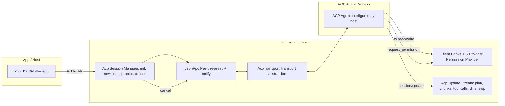
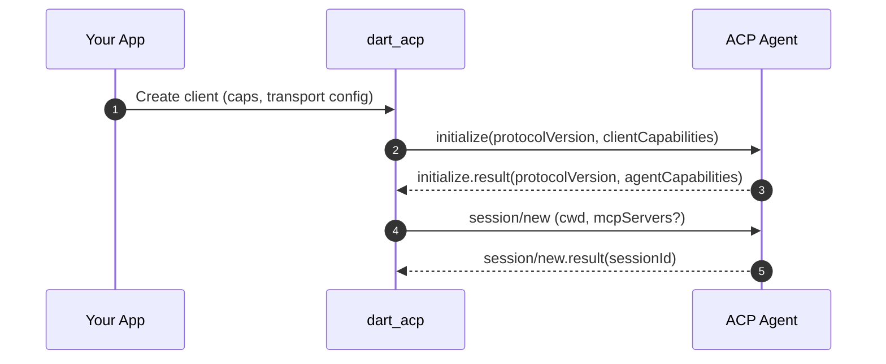
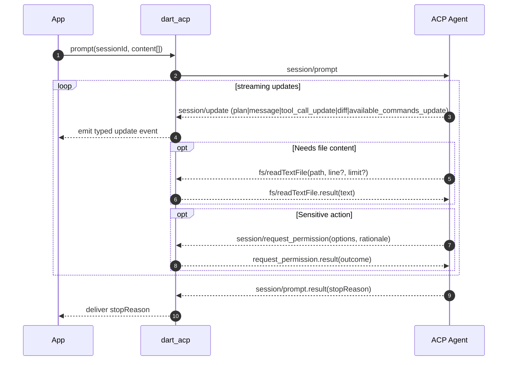
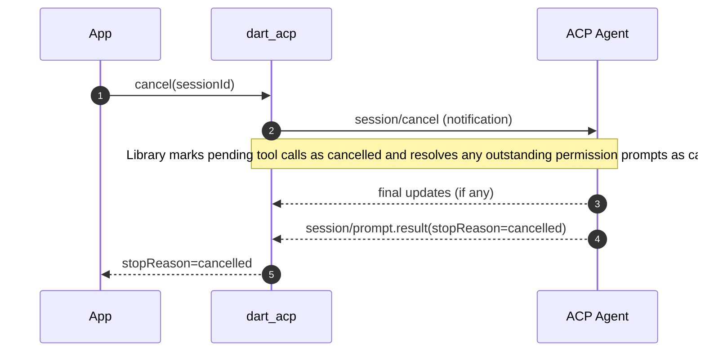
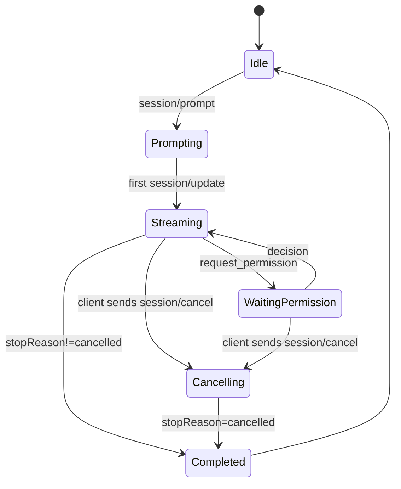

# `dart_acp` Technical Design (Client-Side for ACP)

Client library that lets Dart/Flutter apps connect to ACP agents over a bidirectional stream. This document covers the design of both the `dart_acp` library and the separate example CLI located under `example/`.

ACP Specification: https://agentclientprotocol.com/overview/introduction

---

## 1. Summary

`dart_acp` is a Dart client for the **Agent Client Protocol (ACP)** (JSON‑RPC 2.0 over a bidirectional stream). It provides:

- A high‑level client façade for **initialize → session/new|session/load → session/prompt → session/cancel**.
- A **stream of updates** (plan changes, assistant message chunks, tool calls, diffs, available commands, etc.).
- **Agent→Client callbacks** for file system reads/writes and permission prompts.
- **Transport abstraction** (transport‑agnostic; supports stdio; TCP/WebSocket also possible).
\- **CLI settings**: the example CLI resolves agent command/args and environment overlay from a `settings.json` file located next to the CLI (script directory).

This library enables Dart apps—and `dartantic_ai` via a small adapter—to talk to ACP agents configured by the host.

### 1.1 Library vs CLI

- **Library (`dart_acp`)**: A reusable client providing transports, JSON‑RPC peer, session management, providers (FS, permissions, terminal), and a typed updates stream. It is UI‑agnostic and agent‑agnostic. The library does not read `settings.json`; callers must provide `workspaceRoot`, `agentCommand`, `agentArgs`, and `envOverrides` explicitly.
- **Example CLI (`example/agcli.dart`)**: A minimal command‑line program demonstrating the library. The CLI resolves the agent via `settings.json` located next to the CLI (script directory), starts a session in the current working directory, sends a single prompt, streams updates to stdout, and supports `--agent/-a` and `--jsonl/-j`.

---

## 2. Goals & Non‑Goals

### Goals
- Be a **strict ACP client** that is transport‑agnostic and interoperable with ACP agents over supported transports.
- Expose a **strongly‑typed events stream** of ACP `session/update` notifications.
- Provide **pluggable providers** for FS access and permission decisions.
- No credential flows in the client; environment overlay provided by the host. The example CLI reads `settings.json` next to the CLI to build env/command.

### Non‑Goals
- No storage of credentials, no OAuth UI, no secret management vaults.
- No opinionated UI for diffs/edits—only structured events that a host app can render.
- No agent‑side implementation (that could be a sibling package later).

---

## 3. Architecture Overview



**Key points**  
- **Transport** abstracts how bytes flow; first implementation spawns a subprocess and wires stdin/stdout.  
- **JsonRpc Peer** is a single bidirectional peer so the agent can issue callbacks to the client.  
- **Session Manager** encapsulates ACP method orchestration, session lifecycle, and update demux.  
- **Hooks** are app‑provided handlers used when the agent requests FS or permissions.  
- **Update Stream** provides a single, ordered stream the host can subscribe to.

---

## 4. Protocol Mapping (ACP → Library Responsibilities)

- **initialize**: Negotiate protocol version and capability exchange. Library exposes a simple “client capabilities” struct (e.g., `fs.readTextFile`, `fs.writeTextFile`) and records agent capabilities/methods.  
- **session/new** & **session/load**: Start a new session (specify working directory / workspace root) or load an existing one if supported by the agent.  
- **session/prompt**: Send content blocks; stream `session/update` notifications (plan entries, assistant message deltas, tool calls with status, diffs, available command updates, etc.); complete with a **StopReason**.  
- **session/cancel**: Notify the agent; ensure pending permission prompts are resolved as cancelled; expect a final prompt result with `stopReason=cancelled`.  
- **Agent→Client**: Handle `fs.readTextFile`/`fs.writeTextFile` and `session/request_permission` via the configured providers.

---

## 5. Lifecycle & Flows

### 5.1 Initialization → Session Creation



### 5.2 Prompt Turn with Updates, FS, Permission



### 5.3 Cancellation Semantics



### 5.4 Turn State Machine



---

## 6. Environment-Only Configuration

Design principle: the client does not implement any credential flows. Any credentials required by an agent must be provided via the spawned process environment. When using the example CLI, these variables are configured via `settings.json` next to the CLI (see §8.1). The library itself does not read `settings.json` and expects the host to supply env.

Constraints
- No secret storage and no interactive login UIs in the client.  
- Environment overlay is additive and does not leak back to the parent process.  
- If the agent requires credentials, it must read them from environment variables as documented by that agent.

---

## 7. Public Surfaces (Described, Not Coded)

- **Client façade**: create/destroy client; initialize; new/load session; prompt; cancel.  
- **Update stream**: single stream of typed events for plan items, message deltas, tool‑call events (created/updated/completed), diffs, available commands, and a terminal “turn ended” event with **StopReason**.  
- **Providers**: 
  - **FS Provider**: read & write text files (workspace‑jail enforced; path normalization; symlink resolution).  
  - **Permission Provider**: policy or interactive decision for each `session/request_permission` (supports structured rationale and option rendering).  
- **Transport**: stdio process (spawn agent binary; configurable executable + args + cwd + extra env).  
- **Configuration**: see §6 (environment-only configuration; no credential flows in client).

---

## 8. Configuration (Library)

- **Agent command**: executable name and args (provided explicitly by the host).  
- **Workspace root**: absolute path used for FS jail and as the default `cwd` for new sessions.  
- **Client capabilities**: booleans for `fs.readTextFile`, `fs.writeTextFile`, etc. (disabled by default for safety; opt‑in to enable).  
- **Environment behavior**: inherit parent env by default; optional additional env map; no persistence.  
- **Timeouts**: per‑call configurable (initialize, prompt, permission).  
- **Backpressure**: bounded notification queue size with drop/slow‑reader policy (configured).

### 8.1 Example CLI Agent Selection via `settings.json`

To support multiple ACP agents and per‑agent launch options, the example CLI resolves the agent process from a JSON settings file located next to the CLI (the script directory) and an optional CLI flag. The library does not read this file; it accepts explicit configuration from the caller.

- **Settings file path**: `settings.json` (in the CLI script directory).  
- **Strict JSON**: parsed with `dart:convert` (`jsonDecode`). No comments or trailing commas allowed.  
- **Schema**:

  ```json
  {
    "agent_servers": {
      "your_agent": {
        "command": "path_to_executable",
        "args": [],
        "env": {}
      }
    }
  }
  ```

  Example:

  ```json
  {
    "agent_servers": {
      "my-agent": {
        "command": "agent-binary",
        "args": ["--flag"],
        "env": {
          "ACP_PERMISSION_MODE": "acceptEdits",
          "ACP_DEBUG": "true"
        }
      }
    }
  }
  ```

- **CLI flags**:  
  - `--agent <name>` (`-a <name>`): selects an agent by key from `agent_servers`.  
  - `--output <mode>` (`-o`): `jsonl|json|text|simple` (json is an alias for jsonl).  
  - `--list-commands`: print available slash commands (AvailableCommand[]) without sending a prompt; waits for `available_commands_update`.  
  - `--yolo`: enables read‑everywhere and write capability (writes still confined to CWD).  
  - `--write`: enables write capability (still confined to CWD).  
  - `--resume <id>` / `--save-session <path>`: session resume helpers.  
  - `--help` (`-h`): prints usage.

- **Selection rules**:  
  1) If `--agent` is provided, use that agent key.  
  2) Otherwise, default to the first listed key under `agent_servers` (based on insertion order preserved by `jsonDecode`’s `LinkedHashMap`).

- **Validation & errors**:  
  - If `settings.json` is missing, unreadable, malformed, or lacks `agent_servers`, the client exits with a non‑zero status and a clear error message.  
  - If `--agent <name>` is provided but the key is not present, the client exits with a non‑zero status and a clear error.  
  - Each agent entry must provide `command` (string). `args` (array of strings) and `env` (object of string→string) are optional; non‑string values are rejected with an error.  
  - If the resolved command cannot be started by the OS, surface a descriptive error; no implicit fallbacks are applied by the client.

- **Environment merge**:  
  - The spawned process environment is the parent environment overlaid with the selected agent’s `env` map. Keys in `env` override duplicates; unspecified keys are inherited as‑is. No mutation leaks back to the parent process.

- **Execution**:  
  - Launch the selected agent using its `command` and `args` from `settings.json`.  
  - The working directory for the agent remains the configured workspace root unless the host overrides when creating a session.

### 8.2 Logging and JSONL Mode

When `--jsonl`/`-j` is set:

- **Protocol echo**: Echo every JSON‑RPC frame the client sends to the agent and every frame received from the agent to `stdout` as raw JSONL (exact bytes per line, no prefixes like `>>`/`<<`).  
- **Mutual exclusivity**: JSONL or plain text, not both. In JSONL mode, the CLI does not emit the assistant’s plain‑text response; without `--jsonl`, the CLI streams only the assistant’s plain‑text response and does not mirror protocol frames.  
- **Streams**: JSONL goes to `stdout`. Errors and diagnostics (non‑JSON lines) go to `stderr`.
- **Client metadata line**: Before sending any protocol requests, the CLI emits a single JSON‑RPC notification line to `stdout` with `method="client/selected_agent"` and params `{ name, command }`. This line is for human/tooling context only and is not sent to the ACP agent; it is not part of the transport stream. Arguments and environment variables are deliberately omitted to avoid leaking secrets.

---

## 9. Security & Privacy

- **Workspace jail**: deny FS access outside the configured root; canonicalize paths and resolve symlinks before allow/deny.  
- **Permission mediation**: route every sensitive request through the Permission Provider; support sticky decisions (per session / per agent) if the host app wants it.  
- **Cancellation hygiene**: on cancel, mark pending tool calls cancelled and resolve outstanding permission prompts as cancelled.  
- **No secret storage**: never persist API keys or tokens; do not log secrets; redact in diagnostics.  
- **Crash isolation**: agent runs out‑of‑process; if it crashes, library surfaces a structured error to the host.

---

## 10. Error Handling & Diagnostics

- **Structured errors**: propagate JSON‑RPC error `code/message/data` to the host app.  
- **Transport faults**: map to retryable/non‑retryable errors; provide last N protocol frames for debugging (redacted).  
- **Protocol violations**: fail the in‑flight call and close the session if needed.  
- **Agent availability**: friendly message if the agent executable is not found on `PATH`.  
- **Observability hooks**: optional logger callback (with PII/secret redaction).

---

## 11. Performance Considerations

- **Streaming-first**: flush updates as they arrive; avoid buffering large diffs.  
- **Coalescing**: optionally coalesce frequent plan updates.  
- **Zero‑copy text**: pass message chunks as references where possible.  
- **Concurrency**: handle multiple Agent→Client requests (FS/permissions) concurrently with backpressure.

---

## 12. Interop & Compatibility

- **ACP versions**: client proposes a preferred protocol version; accepts the agent’s negotiated version and only uses advertised capabilities.  
- **Multi‑agent support**: works with any ACP‑compatible agent configured via `settings.json` (for the example CLI).  
- **Credentials**: agents that require credentials must obtain them from environment variables; the client does not implement authentication flows.

---

## 13. Testing Strategy

- **Golden flows**: initialize → new → prompt → updates → stopReason.  
- **Hook fakes**: simulated FS and permissions for deterministic tests.  
- **Cancellation tests**: verify `stopReason=cancelled` and permission prompts resolved as cancelled.  
- **Agent exec discovery**: skip integration tests if the agent binary is unavailable.  
- **Settings.json tests**: parsing, validation errors, agent selection, and environment overlay semantics.

---

## 14. Release Plan

- **v0.1.0**: stdio transport; initialize/new/load/prompt/cancel; FS + permission hooks; updates stream; example with a generic ACP agent.  
- **v0.2.0**: diagnostics improvements, backpressure/timeout knobs.  
- **v0.3.0** *(this design)*: CLI agent selection via `settings.json` next to the CLI (`--agent/-a`), strict JSON parsing, first‑listed default, env merge overlay, error semantics for missing file/agent, and JSONL mirroring to `stdout` (`--jsonl/-j`).  
- **Future**: TCP/WebSocket transport; agent‑side Dart helpers; richer diff/command UX adapters; MCP server discovery passthrough.

---

## 15. Open Questions / Decisions for Chris

1. **FS capabilities default**: keep disabled by default (safer) or enable read by default and gate write?  
2. **Permission UX policy**: should the default be *prompt* (interactive) or *deny* unless explicitly allowed?  
3. **Env variable guidance**: any conventions you want documented for common variables (naming, casing) without listing provider-specific keys?  
4. **Backpressure policy**: on slow consumer, prefer blocking the transport read or dropping oldest updates (with a warning)?  
5. **StopReason surfacing**: anything special your `dartantic_ai` adapter should map (e.g., `refusal` → a specific UI state)?

---

## 16. Appendices

### 16.1 Terminology
- **Agent**: the ACP‑speaking process configured by the host.  
- **Client**: this library running inside your app.  
- **Update**: any `session/update` notification (plan, message chunk, tool call, diff, etc.).  
- **StopReason**: terminal reason after a `session/prompt` turn ends (e.g., `end_turn`, `max_tokens`, `cancelled`).

---

## 17. Example CLI (Design & Usage)

The example CLI in `example/agcli.dart` demonstrates how to use the `dart_acp` library from a terminal. It is intentionally minimal and intended as reference code, not a polished tool.

### 17.1 Synopsis

```bash
dart example/agcli.dart [options] [--] [prompt]
```

- If `prompt` is provided, it is sent as a single turn to the agent.  
- If `prompt` is omitted, the CLI reads the prompt from stdin until EOF.  
- The working directory (`cwd`) is used as the workspace root and FS jail.

### 17.2 Options

- `-a, --agent <name>`: Selects an agent by key from `settings.json` (script directory) → `agent_servers`. If absent, defaults to the first listed agent. Missing file or unknown agent is an error and exits non‑zero.
- `-o, --output <mode>`: One of `jsonl|json|text|simple` (default: `text`). `json` is an alias for `jsonl`. In `jsonl`/`json` modes, all protocol frames are mirrored to stdout and no human text is printed.
- `--yolo`: Enables read‑everywhere and write capability; writes remain confined to the CWD (outside‑workspace writes are denied with a descriptive error).
- `--write`: Enables `fs.writeTextFile` capability (still confined to the CWD).
- `--resume <sessionId>`: Calls `session/load` then sends the prompt.
- `--save-session <path>`: Saves a newly created `sessionId` to the specified file.
- `-h, --help`: Prints usage and exits.

### 17.3 Configuration (`settings.json` next to CLI)

The CLI uses the schema in §8.1. The file must exist next to the CLI (the `example/` directory when running `dart example/agcli.dart`).

Example:

```json
{
  "agent_servers": {
    "my-agent": {
      "command": "agent-binary",
      "args": ["--flag"],
      "env": {
        "ACP_PERMISSION_MODE": "acceptEdits",
        "ACP_DEBUG": "true"
      }
    }
  },
  "mcp_servers": [
    {
      "name": "filesystem",
      "command": "/abs/path/to/mcp-server",
      "args": ["--stdio"],
      "env": { "FOO": "bar" }
    }
  ]
}
```

### 17.4 Behavior

- Resolves the agent using §8.1 rules, merges `env` over the current process environment, and spawns the agent process with `cwd` as the workspace root.  
- Issues `initialize`, creates a new session, sends the prompt, and streams updates until a terminal `StopReason`.  
- On `SIGINT` (Ctrl‑C), requests cancellation (`session/cancel`) and exits non‑zero.

### 17.5 Output

- `-o text` (default): human‑friendly streaming information:
  - Assistant message text chunks as they arrive.  
  - Plan updates (`[plan] ...`).  
  - Tool call updates (`[tool] ...`).  
  - Diffs (`[diff] ...`).  
  - Available commands (`[commands] ...`).  
  - Note: no explicit "Turn ended" line is printed.
- `-o simple`: only the assistant’s streaming text chunks.
- `-o jsonl|json`: raw JSON‑RPC frames (JSON Lines) for both directions. Stderr is used for errors/diagnostics only.

### 17.7 Triggering Behaviors (Prompts)

The CLI is prompt‑first: it doesn’t synthesize protocol frames beyond `--list-commands`. Use prompts that elicit the desired ACP updates:

- Commands:
  - `--list-commands` with no prompt does not send a prompt; it waits for and surfaces `available_commands_update`.
  - Or: “List your available commands and briefly describe each one. Do not execute anything until further instruction.”
  - Expect `session/update` with `sessionUpdate=available_commands_update`.

- Plans:
  - “Before doing anything, produce a 3‑step plan to add a ‘Testing’ section to README.md. Stream plan updates for each step as you go. Stop after presenting the plan; do not apply changes yet.”
  - Expect `session/update` containing `plan`.

- Diffs:
  - “Propose changes to README.md adding a ‘How to Test’ section. Do not apply changes; send only a diff.”
  - Expect `session/update` with `sessionUpdate=diff`.

- File I/O sanity:
  - “Read README.md and summarize in one paragraph.”
  - Expect `tool_call`/`tool_call_update` frames.

### 17.6 Exit Codes

- `0`: Prompt completed successfully (any non‑error `StopReason`).  
- `>0`: Configuration, transport, or protocol error (including missing/invalid `settings.json` or unknown agent).

### 17.7 Examples

```bash
# With inline prompt and default (first) agent
dart example/agcli.dart "Summarize README.md"

# Select agent explicitly and enable JSONL protocol mirroring
dart example/agcli.dart -a my-agent -o jsonl "List available commands"

# Read prompt from stdin
echo "Refactor the following code…" | dart example/agcli.dart -o jsonl
```
