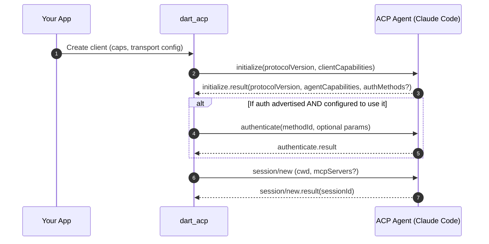
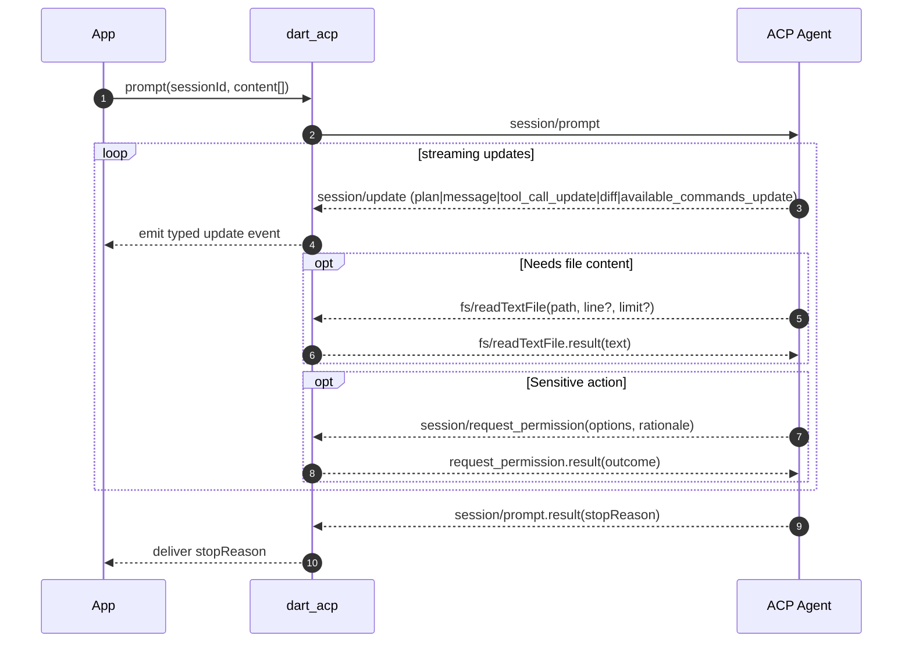
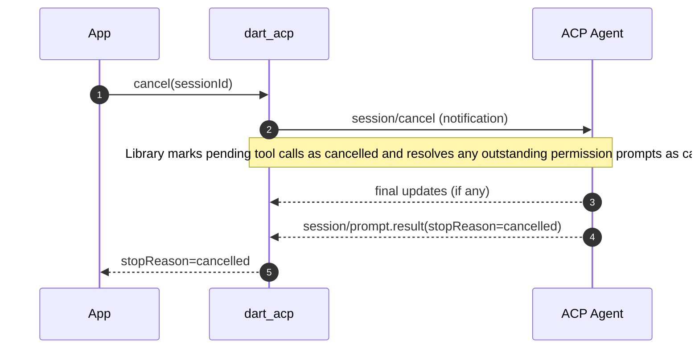
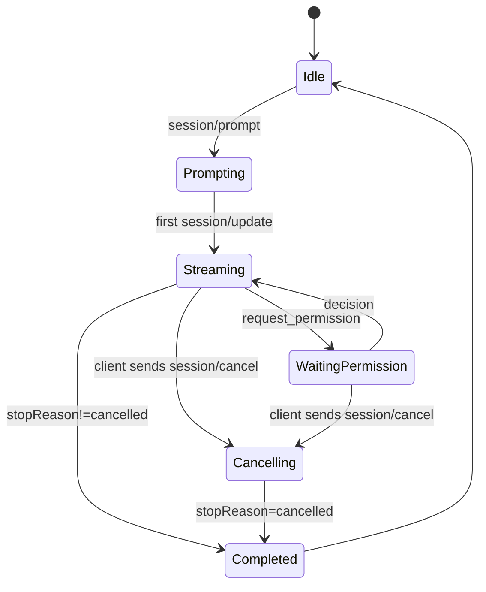

# `dart_acp` Technical Design (Client-Side for ACP)

**Version:** 0.2 (adds optional API key *support* without making it *required*)  
**Date:** 2025‑09‑04  
**Owner:** Chris & Chappy (implementation in Dart)  
**Scope:** Client library that lets Dart/Flutter apps connect to ACP agents (e.g., Claude Code ACP) over a bidirectional stream (stdio first). *No implementation code included in this document.*

ACP Specification: https://agentclientprotocol.com/overview/introduction

---

## 1. Summary

`dart_acp` is a Dart client for the **Agent Client Protocol (ACP)** (JSON‑RPC 2.0 over a bidirectional stream). It provides:

- A high‑level client façade for **initialize → session/new|session/load → session/prompt → session/cancel**.
- A **stream of updates** (plan changes, assistant message chunks, tool calls, diffs, available commands, etc.).
- **Agent→Client callbacks** for file system reads/writes and permission prompts.
- **Transport abstraction** (stdio first; future TCP/WebSocket).
- **Credentials strategy** that *supports* API keys without *requiring* them (see §6).

This library enables Dart apps—and `dartantic_ai` via a small adapter—to talk to ACP agents such as the **Claude Code ACP adapter**.

---

## 2. Goals & Non‑Goals

### Goals
- Be a **strict ACP client** that is transport‑agnostic and works with Claude Code ACP via stdio.
- Expose a **strongly‑typed events stream** of ACP `session/update` notifications.
- Provide **pluggable providers** for FS access and permission decisions.
- **Support, not require, API keys** (inherit pass‑through env; optional overrides; optional JSON‑RPC `authenticate` if agent requests it).

### Non‑Goals
- No storage of credentials, no OAuth UI, no secret management vaults.
- No opinionated UI for diffs/edits—only structured events that a host app can render.
- No agent‑side implementation (that could be a sibling package later).

---

## 3. Architecture Overview

```mermaid
flowchart LR
  subgraph App / Host
    A[Your Dart/Flutter App]
  end

  subgraph dart_acp Library
    T[AcpTransport\n(stdio first)]
    P[JsonRpc Peer\n(req/resp + notify)]
    S[Acp Session Manager\n(init,new,load,prompt,cancel)]
    H[Client Hooks\nFS Provider, Permission Provider]
    U[Acp Update Stream\nplan, chunks, tool calls, diffs, stop]
  end

  subgraph ACP Agent Process
    Z[ACP Agent\n(e.g., claude-code-acp)]
  end

  A -->|Public API| S
  S --> P
  P <--> T
  T <--> Z
  Z -->|session/update| U
  Z -->|fs.read/write| H
  Z -->|request_permission| H
  S -->|cancel| P
```

**Key points**  
- **Transport** abstracts how bytes flow; first implementation spawns a subprocess and wires stdin/stdout.  
- **JsonRpc Peer** is a single bidirectional peer so the agent can issue callbacks to the client.  
- **Session Manager** encapsulates ACP method orchestration, session lifecycle, and update demux.  
- **Hooks** are app‑provided handlers used when the agent requests FS or permissions.  
- **Update Stream** provides a single, ordered stream the host can subscribe to.

---

## 4. Protocol Mapping (ACP → Library Responsibilities)

- **initialize**: Negotiate protocol version and capability exchange. Library exposes a simple “client capabilities” struct (e.g., `fs.readTextFile`, `fs.writeTextFile`) and records agent capabilities/methods.  
- **authenticate** *(optional)*: If the agent advertises auth methods, the library invokes `authenticate` with a method identifier and returns the agent’s result. *This call is optional and only performed when the agent requests it.*  
- **session/new** & **session/load**: Start a new session (specify working directory / workspace root) or load an existing one if supported by the agent.  
- **session/prompt**: Send content blocks; stream `session/update` notifications (plan entries, assistant message deltas, tool calls with status, diffs, available command updates, etc.); complete with a **StopReason**.  
- **session/cancel**: Notify the agent; ensure pending permission prompts are resolved as cancelled; expect a final prompt result with `stopReason=cancelled`.  
- **Agent→Client**: Handle `fs.readTextFile`/`fs.writeTextFile` and `session/request_permission` via the configured providers.

---

## 5. Lifecycle & Flows

### 5.1 Initialization → Session Creation



### 5.2 Prompt Turn with Updates, FS, Permission



### 5.3 Cancellation Semantics



### 5.4 Turn State Machine



---

## 6. Credentials Strategy (API Keys Supported but Not Required)

**Design Principle:** *The library must function with zero credentials provided.* If the agent (e.g., Claude Code ACP) can operate using the user’s logged‑in session, the library does **not** block or prompt. However, if the user supplies API keys or the agent requires authentication, the library **supports** it.

### 6.1 Strategy Matrix

| Strategy                                 | Default | How it works                                                                                                                                                 | Where configured                                | Notes                                            |
| ---------------------------------------- | ------- | ------------------------------------------------------------------------------------------------------------------------------------------------------------ | ----------------------------------------------- | ------------------------------------------------ |
| **Agent‑managed login**                  | ✅       | Library spawns the agent; agent uses its own logged‑in user session.                                                                                         | Transport/agent process config.                 | No keys passed; zero setup path.                 |
| **Environment pass‑through**             | ✅       | Library inherits the current process environment when spawning the agent, so keys like `ANTHROPIC_API_KEY`, `OPENAI_API_KEY`, etc. are visible to the agent. | Host process environment.                       | Library never stores keys; just pass‑through.    |
| **Environment overrides (opt‑in)**       | ✅       | Caller may supply an **optional** map of env vars to *augment* the spawned process environment.                                                              | Library configuration (“additional env”).       | For sandboxing or multi‑key testing.             |
| **JSON‑RPC authenticate (if requested)** | ✅       | If the agent advertises an auth method at `initialize`, the library can call `authenticate(methodId, params)` via an **optional** credentials provider.      | Library configuration (“credentials provider”). | No UI; provider returns opaque params or tokens. |

**Constraints**  
- The library never persists secrets and never opens interactive login UIs.  
- Absence of keys must **not** be treated as an error unless the agent itself refuses to run.  
- Environment overrides must be additive and must not leak back to the parent process.

---

## 7. Public Surfaces (Described, Not Coded)

- **Client façade**: create/destroy client; initialize; new/load session; prompt; cancel.  
- **Update stream**: single stream of typed events for plan items, message deltas, tool‑call events (created/updated/completed), diffs, available commands, and a terminal “turn ended” event with **StopReason**.  
- **Providers**: 
  - **FS Provider**: read & write text files (workspace‑jail enforced; path normalization; symlink resolution).  
  - **Permission Provider**: policy or interactive decision for each `session/request_permission` (supports structured rationale and option rendering).  
- **Transport**: stdio process (spawn agent binary; configurable executable + args + cwd + extra env).  
- **Credentials**: see §6 (agent login by default; env pass‑through; optional overrides; optional authenticate flow).

---

## 8. Configuration

- **Agent command**: executable name and args (default: `claude-code-acp`).  
- **Workspace root**: absolute path used for FS jail and as the default `cwd` for new sessions.  
- **Client capabilities**: booleans for `fs.readTextFile`, `fs.writeTextFile`, etc. (disabled by default for safety; opt‑in to enable).  
- **Environment behavior**: inherit parent env by default; optional additional env map; no persistence.  
- **Credentials provider** *(optional)*: only used if the agent asks for `authenticate`. Returns opaque payload to send to the agent.  
- **Timeouts**: per‑call configurable (initialize, prompt, permission).  
- **Backpressure**: bounded notification queue size with drop/slow‑reader policy (configured).

---

## 9. Security & Privacy

- **Workspace jail**: deny FS access outside the configured root; canonicalize paths and resolve symlinks before allow/deny.  
- **Permission mediation**: route every sensitive request through the Permission Provider; support sticky decisions (per session / per agent) if the host app wants it.  
- **Cancellation hygiene**: on cancel, mark pending tool calls cancelled and resolve outstanding permission prompts as cancelled.  
- **No secret storage**: never persist API keys or tokens; do not log secrets; redact in diagnostics.  
- **Crash isolation**: agent runs out‑of‑process; if it crashes, library surfaces a structured error to the host.

---

## 10. Error Handling & Diagnostics

- **Structured errors**: propagate JSON‑RPC error `code/message/data` to the host app.  
- **Transport faults**: map to retryable/non‑retryable errors; provide last N protocol frames for debugging (redacted).  
- **Protocol violations**: fail the in‑flight call and close the session if needed.  
- **Agent availability**: friendly message if the agent executable is not found on `PATH`.  
- **Observability hooks**: optional logger callback (with PII/secret redaction).

---

## 11. Performance Considerations

- **Streaming-first**: flush updates as they arrive; avoid buffering large diffs.  
- **Coalescing**: optionally coalesce frequent plan updates.  
- **Zero‑copy text**: pass message chunks as references where possible.  
- **Concurrency**: handle multiple Agent→Client requests (FS/permissions) concurrently with backpressure.

---

## 12. Interop & Compatibility

- **ACP versions**: client proposes a preferred protocol version; accepts the agent’s negotiated version and only uses advertised capabilities.  
- **Claude Code ACP**: primary target; should run with agent‑managed login (no keys) or with keys present in env.  
- **Other agents**: the optional `authenticate` path allows broader compatibility without adding key requirements to the library.

---

## 13. Testing Strategy

- **Golden flows**: initialize → new → prompt → updates → stopReason.  
- **Hook fakes**: simulated FS and permissions for deterministic tests.  
- **Cancellation tests**: verify `stopReason=cancelled` and permission prompts resolved as cancelled.  
- **Agent exec discovery**: skip integration tests if the agent binary is unavailable.  
- **Credential tests**: matrix covering (a) no keys, (b) env pass‑through set, (c) env overrides, (d) agent‑requested authenticate with credentials provider.

---

## 14. Release Plan

- **v0.1.0**: stdio transport; initialize/new/load/prompt/cancel; FS + permission hooks; updates stream; no auth UI; env pass‑through; Claude Code example.  
- **v0.2.0** *(this design)*: adds optional API‑key **support** (env overrides + credentials provider + authenticate); formalizes backpressure/timeout knobs; improved diagnostics.  
- **Future**: TCP/WebSocket transport; agent‑side Dart helpers; richer diff/command UX adapters; MCP server discovery passthrough.

---

## 15. Open Questions / Decisions for Chris

1. **FS capabilities default**: keep disabled by default (safer) or enable read by default and gate write?  
2. **Permission UX policy**: should the default be *prompt* (interactive) or *deny* unless explicitly allowed?  
3. **Env override naming**: any standard keys beyond `ANTHROPIC_API_KEY` you’d like first‑class docs for (e.g., `OPENAI_API_KEY`, `GOOGLE_API_KEY`)?  
4. **Backpressure policy**: on slow consumer, prefer blocking the transport read or dropping oldest updates (with a warning)?  
5. **StopReason surfacing**: anything special your `dartantic_ai` adapter should map (e.g., `refusal` → a specific UI state)?

---

## 16. Appendices

### 16.1 Terminology
- **Agent**: the ACP‑speaking process (e.g., Claude Code ACP).  
- **Client**: this library running inside your app.  
- **Update**: any `session/update` notification (plan, message chunk, tool call, diff, etc.).  
- **StopReason**: terminal reason after a `session/prompt` turn ends (e.g., `end_turn`, `max_tokens`, `cancelled`).

